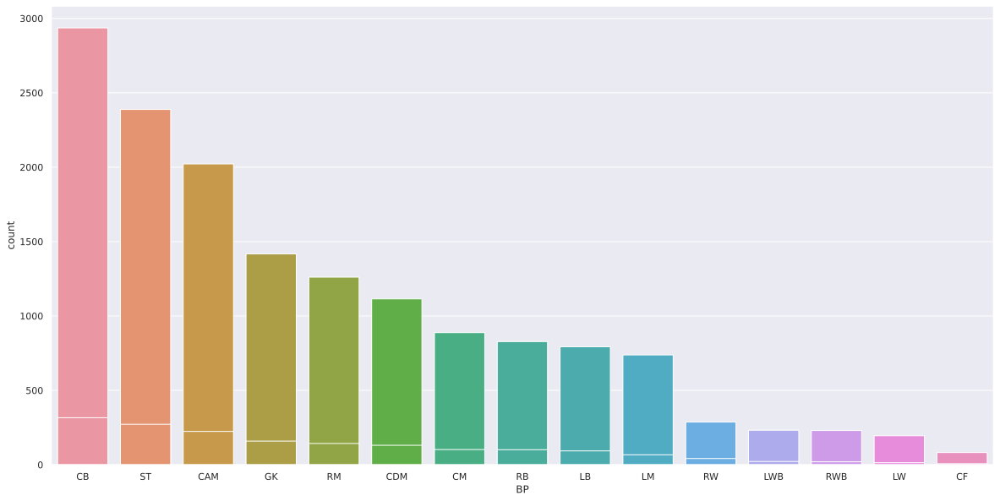
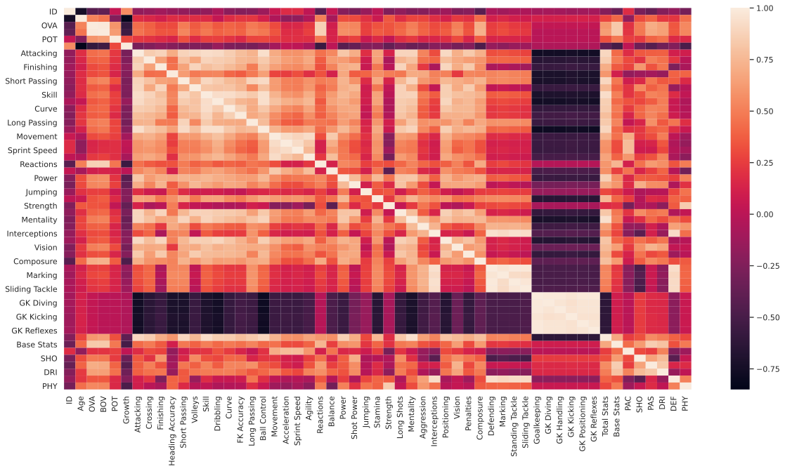
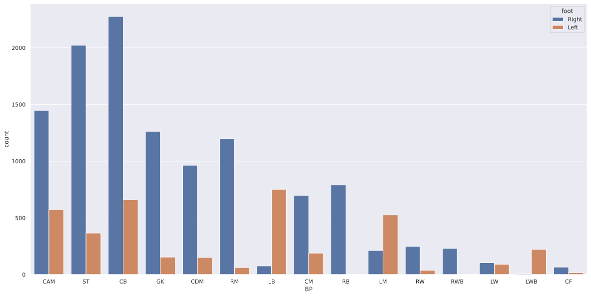
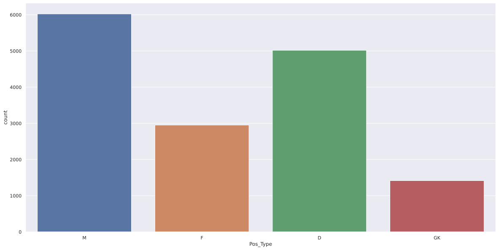
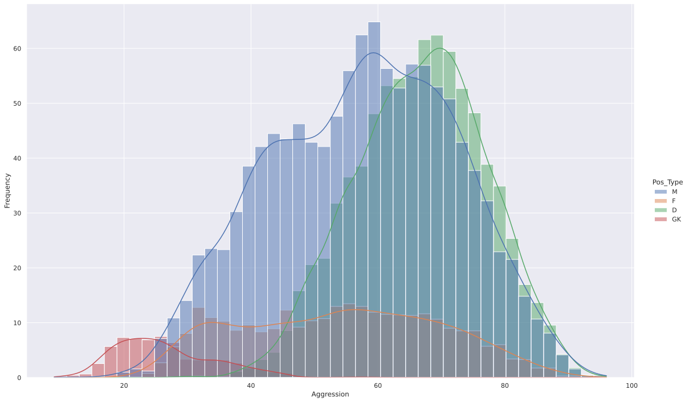
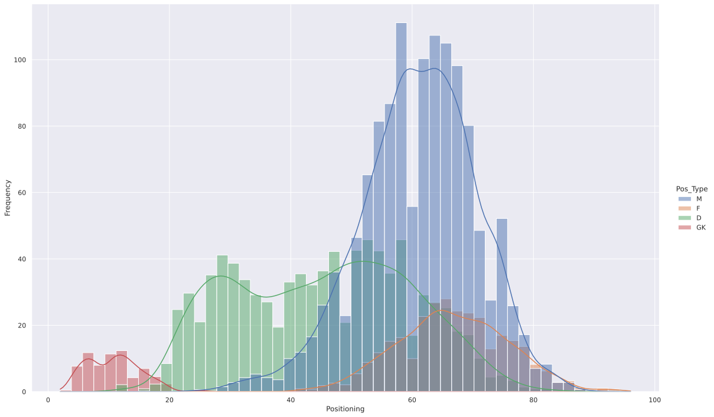
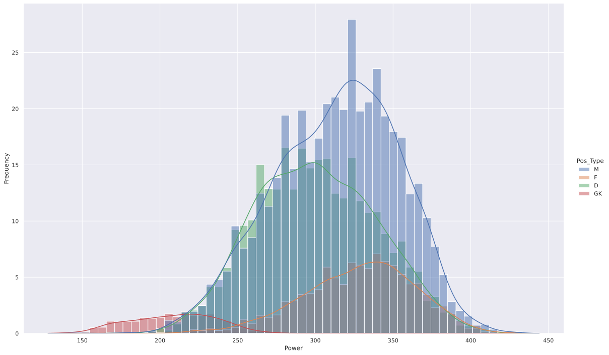
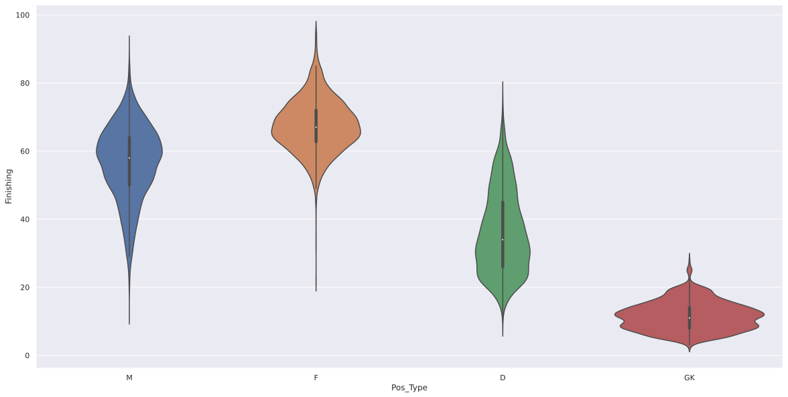
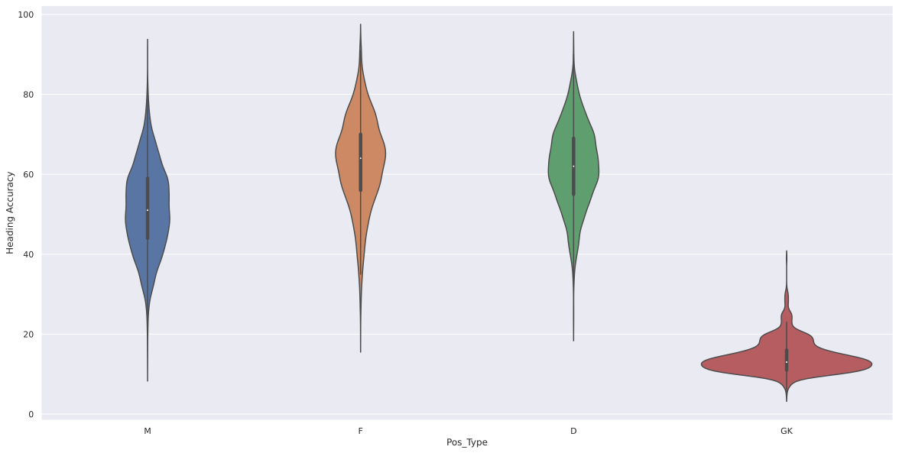
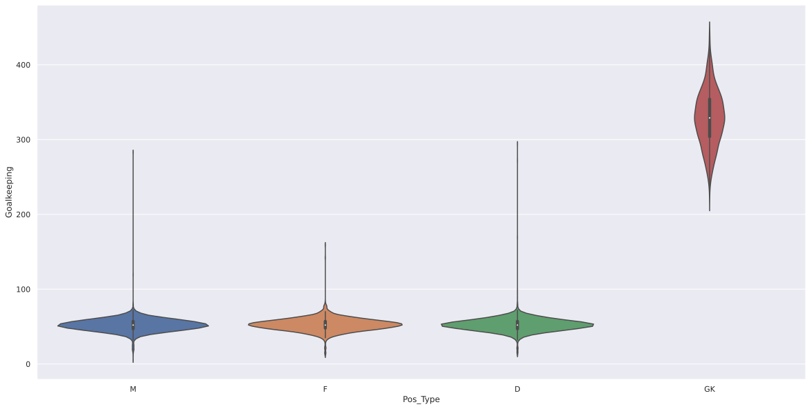

{}

The new FIFA 21 game came out recently, which my flat mate got on release. While playing I thought it would be cool to apply some things I've learnt during Uni, and then I found a dataset of all the players. So I decided to do this project. In the project I will be following a workflow from one of my core [textbooks](http://index-of.es/Varios-2/Hands%20on%20Machine%20Learning%20with%20Scikit%20Learn%20and%20Tensorflow.pdf)

## Framing the Problem
* The **Objective** of this project is to classify player positions based on their statistics and ratings.
* This will be an offline supervised problem
* The performanced will be **measured** by using suitable metrics to calculate the overall accuracy (e.g accuracy, precision, recall, f1score)
* The minimum performace needed to reach the objective is an accuracy of 3.7% (as there are 27 categories, choosing randomly would have this accuracy)

## Getting the Data
The data I will be using is the [Fifa 21 Complete Player Dataset](https://www.kaggle.com/ekrembayar/fifa-21-complete-player-dataset/notebooks). This contains all the info of each player on the FIFA 21 game


```python
# Data handling
import pandas as pd

# Utilities
import numpy as np
import re
import glob

# Plotting
import matplotlib.pyplot as plt
import seaborn as sns

# Preprocessing
from sklearn.model_selection import train_test_split
from sklearn.preprocessing import LabelEncoder
from sklearn.feature_selection import VarianceThreshold, SelectFromModel
from sklearn.preprocessing import StandardScaler

# Models
from sklearn.ensemble import VotingClassifier
from sklearn.neighbors import KNeighborsClassifier
from sklearn.tree import DecisionTreeClassifier, ExtraTreeClassifier
from sklearn.ensemble import RandomForestClassifier, GradientBoostingClassifier
from sklearn.naive_bayes import GaussianNB
from sklearn.neural_network import MLPClassifier
from sklearn.linear_model import SGDClassifier
from sklearn.discriminant_analysis import QuadraticDiscriminantAnalysis

# Model Selection
from sklearn.model_selection import GridSearchCV, RandomizedSearchCV, KFold
from sklearn import model_selection
from sklearn.pipeline import Pipeline

# Evaluation
from sklearn.metrics import accuracy_score, classification_report, make_scorer


# Displays full dataframe
pd.set_option('display.max_rows', None)
pd.set_option('display.max_columns', None)
pd.set_option('display.width', None)
```


```python
df = pd.read_csv('fifa21_male2.csv')
df.head()
```


<div>
<style scoped>
    .dataframe tbody tr th:only-of-type {
        vertical-align: middle;
    }

    .dataframe tbody tr th {
        vertical-align: top;
    }

    .dataframe thead th {
        text-align: right;
    }
</style>
<table border="1" class="dataframe">
  <thead>
    <tr style="text-align: right;">
      <th></th>
      <th>ID</th>
      <th>Name</th>
      <th>Age</th>
      <th>OVA</th>
      <th>Nationality</th>
      <th>Club</th>
      <th>BOV</th>
      <th>BP</th>
      <th>Position</th>
      <th>Player Photo</th>
      <th>Club Logo</th>
      <th>Flag Photo</th>
      <th>POT</th>
      <th>Team &amp; Contract</th>
      <th>Height</th>
      <th>Weight</th>
      <th>foot</th>
      <th>Growth</th>
      <th>Joined</th>
      <th>Loan Date End</th>
      <th>Value</th>
      <th>Wage</th>
      <th>Release Clause</th>
      <th>Contract</th>
      <th>Attacking</th>
      <th>Crossing</th>
      <th>Finishing</th>
      <th>Heading Accuracy</th>
      <th>Short Passing</th>
      <th>Volleys</th>
      <th>Skill</th>
      <th>Dribbling</th>
      <th>Curve</th>
      <th>FK Accuracy</th>
      <th>Long Passing</th>
      <th>Ball Control</th>
      <th>Movement</th>
      <th>Acceleration</th>
      <th>Sprint Speed</th>
      <th>Agility</th>
      <th>Reactions</th>
      <th>Balance</th>
      <th>Power</th>
      <th>Shot Power</th>
      <th>Jumping</th>
      <th>Stamina</th>
      <th>Strength</th>
      <th>Long Shots</th>
      <th>Mentality</th>
      <th>Aggression</th>
      <th>Interceptions</th>
      <th>Positioning</th>
      <th>Vision</th>
      <th>Penalties</th>
      <th>Composure</th>
      <th>Defending</th>
      <th>Marking</th>
      <th>Standing Tackle</th>
      <th>Sliding Tackle</th>
      <th>Goalkeeping</th>
      <th>GK Diving</th>
      <th>GK Handling</th>
      <th>GK Kicking</th>
      <th>GK Positioning</th>
      <th>GK Reflexes</th>
      <th>Total Stats</th>
      <th>Base Stats</th>
      <th>W/F</th>
      <th>SM</th>
      <th>A/W</th>
      <th>D/W</th>
      <th>IR</th>
      <th>PAC</th>
      <th>SHO</th>
      <th>PAS</th>
      <th>DRI</th>
      <th>DEF</th>
      <th>PHY</th>
      <th>Hits</th>
      <th>LS</th>
      <th>ST</th>
      <th>RS</th>
      <th>LW</th>
      <th>LF</th>
      <th>CF</th>
      <th>RF</th>
      <th>RW</th>
      <th>LAM</th>
      <th>CAM</th>
      <th>RAM</th>
      <th>LM</th>
      <th>LCM</th>
      <th>CM</th>
      <th>RCM</th>
      <th>RM</th>
      <th>LWB</th>
      <th>LDM</th>
      <th>CDM</th>
      <th>RDM</th>
      <th>RWB</th>
      <th>LB</th>
      <th>LCB</th>
      <th>CB</th>
      <th>RCB</th>
      <th>RB</th>
      <th>GK</th>
      <th>Gender</th>
    </tr>
  </thead>
  <tbody>
    <tr>
      <th>0</th>
      <td>2</td>
      <td>G. Pasquale</td>
      <td>33</td>
      <td>69</td>
      <td>Italy</td>
      <td>Udinese</td>
      <td>71</td>
      <td>LWB</td>
      <td>LM</td>
      <td>https://cdn.sofifa.com/players/000/002/16_120.png</td>
      <td>https://cdn.sofifa.com/teams/55/light_60.png</td>
      <td>https://cdn.sofifa.com/flags/it.png</td>
      <td>69</td>
      <td>Udinese 2008 ~ 2016</td>
      <td>6'0"</td>
      <td>181lbs</td>
      <td>Left</td>
      <td>0</td>
      <td>Jul 1, 2008</td>
      <td>NaN</td>
      <td>€625K</td>
      <td>€7K</td>
      <td>€0</td>
      <td>2008 ~ 2016</td>
      <td>313</td>
      <td>75</td>
      <td>50</td>
      <td>59</td>
      <td>71</td>
      <td>58.0</td>
      <td>338</td>
      <td>73</td>
      <td>65.0</td>
      <td>60</td>
      <td>69</td>
      <td>71</td>
      <td>347</td>
      <td>68</td>
      <td>74</td>
      <td>68.0</td>
      <td>69</td>
      <td>68.0</td>
      <td>347</td>
      <td>74</td>
      <td>68.0</td>
      <td>69</td>
      <td>68</td>
      <td>68</td>
      <td>320</td>
      <td>72</td>
      <td>69.0</td>
      <td>63.0</td>
      <td>66.0</td>
      <td>50</td>
      <td>NaN</td>
      <td>208</td>
      <td>70</td>
      <td>69</td>
      <td>69.0</td>
      <td>56</td>
      <td>14</td>
      <td>5</td>
      <td>15</td>
      <td>10</td>
      <td>12</td>
      <td>1929</td>
      <td>408</td>
      <td>3 ★</td>
      <td>2★</td>
      <td>Medium</td>
      <td>High</td>
      <td>2 ★</td>
      <td>71</td>
      <td>59</td>
      <td>70</td>
      <td>71</td>
      <td>68</td>
      <td>69</td>
      <td>4</td>
      <td>65+0</td>
      <td>65+0</td>
      <td>65+0</td>
      <td>68+0</td>
      <td>67+0</td>
      <td>67+0</td>
      <td>67+0</td>
      <td>68+0</td>
      <td>68+0</td>
      <td>68+0</td>
      <td>68+0</td>
      <td>69+0</td>
      <td>69+0</td>
      <td>69+0</td>
      <td>69+0</td>
      <td>69+0</td>
      <td>71+-2</td>
      <td>70+-1</td>
      <td>70+-1</td>
      <td>70+-1</td>
      <td>71+-2</td>
      <td>70+-1</td>
      <td>69+0</td>
      <td>69+0</td>
      <td>69+0</td>
      <td>70+-1</td>
      <td>17+0</td>
      <td>Male</td>
    </tr>
    <tr>
      <th>1</th>
      <td>16</td>
      <td>Luis García</td>
      <td>37</td>
      <td>71</td>
      <td>Spain</td>
      <td>KAS Eupen</td>
      <td>70</td>
      <td>CM</td>
      <td>CM CAM CDM</td>
      <td>https://cdn.sofifa.com/players/000/016/19_120.png</td>
      <td>https://cdn.sofifa.com/teams/2013/light_60.png</td>
      <td>https://cdn.sofifa.com/flags/es.png</td>
      <td>71</td>
      <td>KAS Eupen 2014 ~ 2019</td>
      <td>5'10"</td>
      <td>143lbs</td>
      <td>Right</td>
      <td>0</td>
      <td>Jul 19, 2014</td>
      <td>NaN</td>
      <td>€600K</td>
      <td>€7K</td>
      <td>€1.1M</td>
      <td>2014 ~ 2019</td>
      <td>337</td>
      <td>68</td>
      <td>64</td>
      <td>61</td>
      <td>76</td>
      <td>68.0</td>
      <td>369</td>
      <td>69</td>
      <td>79.0</td>
      <td>79</td>
      <td>71</td>
      <td>71</td>
      <td>305</td>
      <td>56</td>
      <td>50</td>
      <td>62.0</td>
      <td>65</td>
      <td>72.0</td>
      <td>324</td>
      <td>75</td>
      <td>54.0</td>
      <td>64</td>
      <td>60</td>
      <td>71</td>
      <td>362</td>
      <td>71</td>
      <td>71.0</td>
      <td>72.0</td>
      <td>73.0</td>
      <td>75</td>
      <td>79.0</td>
      <td>153</td>
      <td>70</td>
      <td>43</td>
      <td>40.0</td>
      <td>56</td>
      <td>9</td>
      <td>12</td>
      <td>13</td>
      <td>11</td>
      <td>11</td>
      <td>1906</td>
      <td>385</td>
      <td>4 ★</td>
      <td>3★</td>
      <td>Medium</td>
      <td>Medium</td>
      <td>1 ★</td>
      <td>53</td>
      <td>69</td>
      <td>73</td>
      <td>69</td>
      <td>58</td>
      <td>63</td>
      <td>4</td>
      <td>67+1</td>
      <td>67+1</td>
      <td>67+1</td>
      <td>67+0</td>
      <td>68+0</td>
      <td>68+0</td>
      <td>68+0</td>
      <td>67+0</td>
      <td>70+1</td>
      <td>70+1</td>
      <td>70+1</td>
      <td>68+1</td>
      <td>70+1</td>
      <td>70+1</td>
      <td>70+1</td>
      <td>68+1</td>
      <td>62+1</td>
      <td>66+1</td>
      <td>66+1</td>
      <td>66+1</td>
      <td>62+1</td>
      <td>60+1</td>
      <td>60+1</td>
      <td>60+1</td>
      <td>60+1</td>
      <td>60+1</td>
      <td>17+1</td>
      <td>Male</td>
    </tr>
    <tr>
      <th>2</th>
      <td>27</td>
      <td>J. Cole</td>
      <td>33</td>
      <td>71</td>
      <td>England</td>
      <td>Coventry City</td>
      <td>71</td>
      <td>CAM</td>
      <td>CAM RM RW LM</td>
      <td>https://cdn.sofifa.com/players/000/027/16_120.png</td>
      <td>https://cdn.sofifa.com/teams/1800/light_60.png</td>
      <td>https://cdn.sofifa.com/flags/gb-eng.png</td>
      <td>71</td>
      <td>Coventry City 2016 ~ 2020</td>
      <td>5'9"</td>
      <td>161lbs</td>
      <td>Right</td>
      <td>0</td>
      <td>Jan 7, 2016</td>
      <td>NaN</td>
      <td>€1.1M</td>
      <td>€15K</td>
      <td>€0</td>
      <td>2016 ~ 2020</td>
      <td>337</td>
      <td>80</td>
      <td>64</td>
      <td>41</td>
      <td>77</td>
      <td>75.0</td>
      <td>387</td>
      <td>79</td>
      <td>84.0</td>
      <td>77</td>
      <td>69</td>
      <td>78</td>
      <td>295</td>
      <td>48</td>
      <td>42</td>
      <td>71.0</td>
      <td>59</td>
      <td>75.0</td>
      <td>284</td>
      <td>72</td>
      <td>58.0</td>
      <td>29</td>
      <td>56</td>
      <td>69</td>
      <td>317</td>
      <td>69</td>
      <td>39.0</td>
      <td>69.0</td>
      <td>74.0</td>
      <td>66</td>
      <td>NaN</td>
      <td>99</td>
      <td>35</td>
      <td>34</td>
      <td>30.0</td>
      <td>51</td>
      <td>9</td>
      <td>6</td>
      <td>13</td>
      <td>16</td>
      <td>7</td>
      <td>1770</td>
      <td>354</td>
      <td>4 ★</td>
      <td>4★</td>
      <td>Medium</td>
      <td>Low</td>
      <td>2 ★</td>
      <td>45</td>
      <td>68</td>
      <td>76</td>
      <td>77</td>
      <td>36</td>
      <td>52</td>
      <td>11</td>
      <td>64+0</td>
      <td>64+0</td>
      <td>64+0</td>
      <td>70+0</td>
      <td>69+0</td>
      <td>69+0</td>
      <td>69+0</td>
      <td>70+0</td>
      <td>71+0</td>
      <td>71+0</td>
      <td>71+0</td>
      <td>68+0</td>
      <td>66+0</td>
      <td>66+0</td>
      <td>66+0</td>
      <td>68+0</td>
      <td>52+0</td>
      <td>54+0</td>
      <td>54+0</td>
      <td>54+0</td>
      <td>52+0</td>
      <td>47+0</td>
      <td>46+0</td>
      <td>46+0</td>
      <td>46+0</td>
      <td>47+0</td>
      <td>15+0</td>
      <td>Male</td>
    </tr>
    <tr>
      <th>3</th>
      <td>36</td>
      <td>D. Yorke</td>
      <td>36</td>
      <td>68</td>
      <td>Trinidad &amp;amp; Tobago</td>
      <td>Sunderland</td>
      <td>70</td>
      <td>ST</td>
      <td>NaN</td>
      <td>https://cdn.sofifa.com/players/000/036/09_120.png</td>
      <td>https://cdn.sofifa.com/teams/106/light_60.png</td>
      <td>https://cdn.sofifa.com/flags/tt.png</td>
      <td>82</td>
      <td>Sunderland 2009</td>
      <td>5'11"</td>
      <td>165lbs</td>
      <td>Right</td>
      <td>14</td>
      <td>NaN</td>
      <td>NaN</td>
      <td>€0</td>
      <td>€0</td>
      <td>€0</td>
      <td>2009</td>
      <td>264</td>
      <td>54</td>
      <td>70</td>
      <td>60</td>
      <td>80</td>
      <td>NaN</td>
      <td>255</td>
      <td>68</td>
      <td>NaN</td>
      <td>46</td>
      <td>64</td>
      <td>77</td>
      <td>176</td>
      <td>59</td>
      <td>62</td>
      <td>NaN</td>
      <td>55</td>
      <td>NaN</td>
      <td>239</td>
      <td>63</td>
      <td>NaN</td>
      <td>51</td>
      <td>66</td>
      <td>59</td>
      <td>271</td>
      <td>59</td>
      <td>70.0</td>
      <td>72.0</td>
      <td>NaN</td>
      <td>70</td>
      <td>NaN</td>
      <td>75</td>
      <td>34</td>
      <td>41</td>
      <td>NaN</td>
      <td>68</td>
      <td>5</td>
      <td>21</td>
      <td>64</td>
      <td>21</td>
      <td>21</td>
      <td>1348</td>
      <td>369</td>
      <td>3 ★</td>
      <td>1★</td>
      <td>NaN</td>
      <td>NaN</td>
      <td>1 ★</td>
      <td>61</td>
      <td>66</td>
      <td>66</td>
      <td>69</td>
      <td>47</td>
      <td>60</td>
      <td>3</td>
      <td>67+0</td>
      <td>67+0</td>
      <td>67+0</td>
      <td>66+0</td>
      <td>67+0</td>
      <td>67+0</td>
      <td>67+0</td>
      <td>66+0</td>
      <td>70+0</td>
      <td>70+0</td>
      <td>70+0</td>
      <td>66+0</td>
      <td>68+0</td>
      <td>68+0</td>
      <td>68+0</td>
      <td>66+0</td>
      <td>56+0</td>
      <td>65+0</td>
      <td>65+0</td>
      <td>65+0</td>
      <td>56+0</td>
      <td>57+0</td>
      <td>51+0</td>
      <td>51+0</td>
      <td>51+0</td>
      <td>57+0</td>
      <td>22+0</td>
      <td>Male</td>
    </tr>
    <tr>
      <th>4</th>
      <td>41</td>
      <td>Iniesta</td>
      <td>36</td>
      <td>81</td>
      <td>Spain</td>
      <td>Vissel Kobe</td>
      <td>82</td>
      <td>CAM</td>
      <td>CM CAM</td>
      <td>https://cdn.sofifa.com/players/000/041/20_120.png</td>
      <td>https://cdn.sofifa.com/teams/101146/light_60.png</td>
      <td>https://cdn.sofifa.com/flags/es.png</td>
      <td>81</td>
      <td>Vissel Kobe 2018 ~ 2021</td>
      <td>5'7"</td>
      <td>150lbs</td>
      <td>Right</td>
      <td>0</td>
      <td>Jul 16, 2018</td>
      <td>NaN</td>
      <td>€5.5M</td>
      <td>€12K</td>
      <td>€7.2M</td>
      <td>2018 ~ 2021</td>
      <td>367</td>
      <td>75</td>
      <td>69</td>
      <td>54</td>
      <td>90</td>
      <td>79.0</td>
      <td>408</td>
      <td>85</td>
      <td>80.0</td>
      <td>70</td>
      <td>83</td>
      <td>90</td>
      <td>346</td>
      <td>61</td>
      <td>56</td>
      <td>79.0</td>
      <td>75</td>
      <td>75.0</td>
      <td>297</td>
      <td>67</td>
      <td>40.0</td>
      <td>58</td>
      <td>62</td>
      <td>70</td>
      <td>370</td>
      <td>58</td>
      <td>70.0</td>
      <td>78.0</td>
      <td>93.0</td>
      <td>71</td>
      <td>89.0</td>
      <td>181</td>
      <td>68</td>
      <td>57</td>
      <td>56.0</td>
      <td>45</td>
      <td>6</td>
      <td>13</td>
      <td>6</td>
      <td>13</td>
      <td>7</td>
      <td>2014</td>
      <td>420</td>
      <td>4 ★</td>
      <td>4★</td>
      <td>High</td>
      <td>Medium</td>
      <td>4 ★</td>
      <td>58</td>
      <td>70</td>
      <td>85</td>
      <td>85</td>
      <td>63</td>
      <td>59</td>
      <td>149</td>
      <td>72+3</td>
      <td>72+3</td>
      <td>72+3</td>
      <td>79+0</td>
      <td>79+0</td>
      <td>79+0</td>
      <td>79+0</td>
      <td>79+0</td>
      <td>82+-1</td>
      <td>82+-1</td>
      <td>82+-1</td>
      <td>79+2</td>
      <td>81+0</td>
      <td>81+0</td>
      <td>81+0</td>
      <td>79+2</td>
      <td>70+3</td>
      <td>73+3</td>
      <td>73+3</td>
      <td>73+3</td>
      <td>70+3</td>
      <td>67+3</td>
      <td>64+3</td>
      <td>64+3</td>
      <td>64+3</td>
      <td>67+3</td>
      <td>17+3</td>
      <td>Male</td>
    </tr>
  </tbody>
</table>
</div>


I will set aside a sample of 10% for our test set. To validate the models I will be using Cross Validation


```python
train_df, test_df = train_test_split(df, test_size=0.1, random_state=100699)
```

## Exploring the Data

1. Create a copy of the data for exploration (sampling it down to a manageable sizeif necessary).
2. Study each attribute and its characteristics
3. For supervised learning tasks, identify the target attribute(s).
4. Visualize the data.
5. Study the correlations between attributes.


Having a copy of the original data is always a good idea in case you mess anything up


```python
# Creating copy of the data
train_df_copy = train_df.copy()
```

### Attribute and its Characteristics


```python
train_df.dtypes
```


    ID                    int64
    Name                 object
    Age                   int64
    OVA                   int64
    Nationality          object
    Club                 object
    BOV                   int64
    BP                   object
    Position             object
    Player Photo         object
    Club Logo            object
    Flag Photo           object
    POT                   int64
    Team & Contract      object
    Height               object
    Weight               object
    foot                 object
    Growth                int64
    Joined               object
    Loan Date End        object
    Value                object
    Wage                 object
    Release Clause       object
    Contract             object
    Attacking             int64
    Crossing              int64
    Finishing             int64
    Heading Accuracy      int64
    Short Passing         int64
    Volleys             float64
    Skill                 int64
    Dribbling             int64
    Curve               float64
    FK Accuracy           int64
    Long Passing          int64
    Ball Control          int64
    Movement              int64
    Acceleration          int64
    Sprint Speed          int64
    Agility             float64
    Reactions             int64
    Balance             float64
    Power                 int64
    Shot Power            int64
    Jumping             float64
    Stamina               int64
    Strength              int64
    Long Shots            int64
    Mentality             int64
    Aggression            int64
    Interceptions       float64
    Positioning         float64
    Vision              float64
    Penalties             int64
    Composure           float64
    Defending             int64
    Marking               int64
    Standing Tackle       int64
    Sliding Tackle      float64
    Goalkeeping           int64
    GK Diving             int64
    GK Handling           int64
    GK Kicking            int64
    GK Positioning        int64
    GK Reflexes           int64
    Total Stats           int64
    Base Stats            int64
    W/F                  object
    SM                   object
    A/W                  object
    D/W                  object
    IR                   object
    PAC                   int64
    SHO                   int64
    PAS                   int64
    DRI                   int64
    DEF                   int64
    PHY                   int64
    Hits                 object
    LS                   object
    ST                   object
    RS                   object
    LW                   object
    LF                   object
    CF                   object
    RF                   object
    RW                   object
    LAM                  object
    CAM                  object
    RAM                  object
    LM                   object
    LCM                  object
    CM                   object
    RCM                  object
    RM                   object
    LWB                  object
    LDM                  object
    CDM                  object
    RDM                  object
    RWB                  object
    LB                   object
    LCB                  object
    CB                   object
    RCB                  object
    RB                   object
    GK                   object
    Gender               object
    dtype: object


#### Observations
* we can see a mixture of floats, ints and objects
* Some irrelvant features, like ID, player Photo, Club Photo etc.
* There are stats for their overall rating, top level ratings ('Pace', 'Shooting' etc.) and low level ratings e.g 'Shooting' might be made up of 'Shot Power', 'Attacking', 'Curve', 'FK Accuracy', 'penalties' etc.

### Identify the target attribute(s).
Looking at the columns we can 'BP' meaning Best Position will be our target variable. The Columns 'Postions' also provide other postiions they play. An extension of this could also be looking at their ratings of other positions, and predicting the 2nd and 3rd best positions


### Visualize the data.
#### Distribution


```python
sns.set(rc={'figure.figsize':(20,10)})
sns.set_theme(style="darkgrid")
sns.countplot(x="BP", data=train_df, order=train_df["BP"].value_counts().index)
sns.countplot(x="BP", data=test_df, order=test_df["BP"].value_counts().index)
```


    <AxesSubplot:xlabel='BP', ylabel='count'>





Observations
* The classes are unbalanced, this would need to be considered for the evaluation metrics

#### Correlation


```python
corr = train_df.corr()
sns.heatmap(corr)
```


    <AxesSubplot:>





Observation
* Strong correlation for Goalkeeper traits as expected
* Some strong correlations for Defender traits too e.g. Defending, Marking and Tackling


```python
sns.countplot(x="BP", hue = "foot", data=train_df)
```


    <AxesSubplot:xlabel='BP', ylabel='count'>





Observations
* Slight correlation between preferred foot and position. Players on left side more likely to be left footed


```python
forwards = ['LS', 'ST', 'RS', 'LW', 'LF', 'CF', 'RF', 'RW']
midfielders = ['LAM', 'CAM', 'RAM', 'LM', 'LCM', 'CM', 'RCM', 'RM','LDM', 'CDM', 'RDM']
defenders = ['LWB', 'RWB', 'LB', 'LCB', 'CB', 'RCB', 'RB']
gk = ['GK']

def f(row):
    if row["BP"] in forwards:
        return "F"
    elif row["BP"] in midfielders:
        return "M"
    elif row["BP"] in defenders:
        return "D"
    else:
        return "GK"

train_df["Pos_Type"] = train_df.apply(f, axis=1)

```


```python
sns.countplot(data=train_df, x="Pos_Type")
```


    <AxesSubplot:xlabel='Pos_Type', ylabel='count'>





```python
train_df['Height in ft']=pd.to_numeric(train_df['Height'].str[0])
train_df['Height in in']=pd.to_numeric(train_df['Height'].str.split("\'").str[1].str.strip('"'))
train_df['Height in cm']=(train_df['Height in ft']*12+train_df['Height in in'])*2.54
train_df['Weight in lb']=pd.to_numeric(train_df['Weight'].str.strip('lbs'))
```


```python
sns.jointplot(data=train_df, x="Weight in lb", y="Height in cm", hue="Pos_Type", height=10)
```


    <seaborn.axisgrid.JointGrid at 0x7f53494e7c40>


Observations
* Midfielders are more likely to be smaller/shorter
* Goalkeepers are among the tallest.
* Forwards have a big variation in height and weight

The plots below shows distribution of players, based on stats.


```python
sns.displot(data=train_df, x="Aggression", hue="Pos_Type", stat="frequency", kde=True, height=10, aspect=1.6)
sns.displot(data=train_df, x="Positioning", hue="Pos_Type", stat="frequency", kde=True, height=10, aspect=1.6)
sns.displot(data=train_df, x="Power", hue="Pos_Type", stat="frequency", kde=True, height=10, aspect=1.6)
```


    <seaborn.axisgrid.FacetGrid at 0x7f53418bed00>











Another interesting style of visualisation, showing distributiong of positions based on stats.


```python
sns.violinplot(data=train_df, x="Pos_Type", y="Finishing")
```


    <AxesSubplot:xlabel='Pos_Type', ylabel='Finishing'>





```python
sns.violinplot(data=train_df, x="Pos_Type", y="Heading Accuracy")
```


    <AxesSubplot:xlabel='Pos_Type', ylabel='Heading Accuracy'>





```python
sns.violinplot(data=train_df, x="Pos_Type", y="Goalkeeping")
```


    <AxesSubplot:xlabel='Pos_Type', ylabel='Goalkeeping'>





## Preparing the Data

1.  Data cleaning: 
    * Fix or remove outliers (optional).
    * Fill in missing values (e.g., with zero, mean, median...) or drop their rows (orcolumns).
2. Feature selection (optional):
    * Drop the attributes that provide no useful information for the task.
3.  Feature engineering, where appropriate:
    *  Discretize continuous features
    * Decompose features (e.g., categorical, date/time, etc.).
    * Add promising transformations of features (e.g., log(x), sqrt(x), x^2, etc.).
    * Aggregate features into promising new features.
4.  Feature scaling: standardize or normalize features.Short


```python
# Get original data again
train_df = train_df_copy.copy()
```

### Data cleaning


```python
print(list(train_df.columns))
```

    ['ID', 'Name', 'Age', 'OVA', 'Nationality', 'Club', 'BOV', 'BP', 'Position', 'Player Photo', 'Club Logo', 'Flag Photo', 'POT', 'Team & Contract', 'Height', 'Weight', 'foot', 'Growth', 'Joined', 'Loan Date End', 'Value', 'Wage', 'Release Clause', 'Contract', 'Attacking', 'Crossing', 'Finishing', 'Heading Accuracy', 'Short Passing', 'Volleys', 'Skill', 'Dribbling', 'Curve', 'FK Accuracy', 'Long Passing', 'Ball Control', 'Movement', 'Acceleration', 'Sprint Speed', 'Agility', 'Reactions', 'Balance', 'Power', 'Shot Power', 'Jumping', 'Stamina', 'Strength', 'Long Shots', 'Mentality', 'Aggression', 'Interceptions', 'Positioning', 'Vision', 'Penalties', 'Composure', 'Defending', 'Marking', 'Standing Tackle', 'Sliding Tackle', 'Goalkeeping', 'GK Diving', 'GK Handling', 'GK Kicking', 'GK Positioning', 'GK Reflexes', 'Total Stats', 'Base Stats', 'W/F', 'SM', 'A/W', 'D/W', 'IR', 'PAC', 'SHO', 'PAS', 'DRI', 'DEF', 'PHY', 'Hits', 'LS', 'ST', 'RS', 'LW', 'LF', 'CF', 'RF', 'RW', 'LAM', 'CAM', 'RAM', 'LM', 'LCM', 'CM', 'RCM', 'RM', 'LWB', 'LDM', 'CDM', 'RDM', 'RWB', 'LB', 'LCB', 'CB', 'RCB', 'RB', 'GK', 'Gender']


Removing unecessary features. I will also remove the Positions feature, and the rating of the player in pther positions as this is cheating.

### Feature Selection


```python
# Dropping unnecessary features
def feature_selection(df):
    subset = ['ID', 'Name', 'Age', 'Nationality', 'Club', 'Position', 'Player Photo', 'Club Logo', 'Flag Photo', 'Team & Contract','Joined', 'Loan Date End', 'Value', 'Wage',    'Release Clause', 'Contract', 'Hits', 'LS', 'ST', 'RS', 'LW', 'LF', 'CF', 'RF', 'RW', 'LAM', 'CAM', 'RAM', 'LM', 'LCM', 'CM', 'RCM', 'RM', 'LWB', 'LDM', 'CDM', 'RDM',        'RWB', 'LB', 'LCB', 'CB', 'RCB', 'RB', 'GK', 'Gender']
    return df.drop(columns=subset)
    

train_df = feature_selection(train_df)
test_df = feature_selection(test_df)
```

Checking for NaNs in the train and test set


```python
train_df.isnull().sum()
```


    OVA                   0
    BOV                   0
    BP                    0
    POT                   0
    Height                0
    Weight                0
    foot                  0
    Growth                0
    Attacking             0
    Crossing              0
    Finishing             0
    Heading Accuracy      0
    Short Passing         0
    Volleys              54
    Skill                 0
    Dribbling             0
    Curve                54
    FK Accuracy           0
    Long Passing          0
    Ball Control          0
    Movement              0
    Acceleration          0
    Sprint Speed          0
    Agility              54
    Reactions             0
    Balance              54
    Power                 0
    Shot Power            0
    Jumping              54
    Stamina               0
    Strength              0
    Long Shots            0
    Mentality             0
    Aggression            0
    Interceptions         6
    Positioning           6
    Vision               54
    Penalties             0
    Composure           380
    Defending             0
    Marking               0
    Standing Tackle       0
    Sliding Tackle       54
    Goalkeeping           0
    GK Diving             0
    GK Handling           0
    GK Kicking            0
    GK Positioning        0
    GK Reflexes           0
    Total Stats           0
    Base Stats            0
    W/F                   0
    SM                    0
    A/W                  79
    D/W                  79
    IR                    0
    PAC                   0
    SHO                   0
    PAS                   0
    DRI                   0
    DEF                   0
    PHY                   0
    dtype: int64


```python
test_df.isnull().sum()
```


    OVA                  0
    BOV                  0
    BP                   0
    POT                  0
    Height               0
    Weight               0
    foot                 0
    Growth               0
    Attacking            0
    Crossing             0
    Finishing            0
    Heading Accuracy     0
    Short Passing        0
    Volleys              4
    Skill                0
    Dribbling            0
    Curve                4
    FK Accuracy          0
    Long Passing         0
    Ball Control         0
    Movement             0
    Acceleration         0
    Sprint Speed         0
    Agility              4
    Reactions            0
    Balance              4
    Power                0
    Shot Power           0
    Jumping              4
    Stamina              0
    Strength             0
    Long Shots           0
    Mentality            0
    Aggression           0
    Interceptions        1
    Positioning          1
    Vision               4
    Penalties            0
    Composure           43
    Defending            0
    Marking              0
    Standing Tackle      0
    Sliding Tackle       4
    Goalkeeping          0
    GK Diving            0
    GK Handling          0
    GK Kicking           0
    GK Positioning       0
    GK Reflexes          0
    Total Stats          0
    Base Stats           0
    W/F                  0
    SM                   0
    A/W                 10
    D/W                 10
    IR                   0
    PAC                  0
    SHO                  0
    PAS                  0
    DRI                  0
    DEF                  0
    PHY                  0
    dtype: int64


```python
# Replace NaNs with mean of that value
def replaceNaN(df):
    for c in df.columns[df.isna().any()].tolist():
        if c == "A/W" or c == "D/W":
            df[c] =  "Medium"
        else:
            df[c].fillna(df[c].mean(), inplace=True)
    return df

train_df = replaceNaN(train_df)
test_df = replaceNaN(test_df)

```

Check again :)


```python
train_df.isna().sum()
```


    OVA                 0
    BOV                 0
    BP                  0
    POT                 0
    Height              0
    Weight              0
    foot                0
    Growth              0
    Attacking           0
    Crossing            0
    Finishing           0
    Heading Accuracy    0
    Short Passing       0
    Volleys             0
    Skill               0
    Dribbling           0
    Curve               0
    FK Accuracy         0
    Long Passing        0
    Ball Control        0
    Movement            0
    Acceleration        0
    Sprint Speed        0
    Agility             0
    Reactions           0
    Balance             0
    Power               0
    Shot Power          0
    Jumping             0
    Stamina             0
    Strength            0
    Long Shots          0
    Mentality           0
    Aggression          0
    Interceptions       0
    Positioning         0
    Vision              0
    Penalties           0
    Composure           0
    Defending           0
    Marking             0
    Standing Tackle     0
    Sliding Tackle      0
    Goalkeeping         0
    GK Diving           0
    GK Handling         0
    GK Kicking          0
    GK Positioning      0
    GK Reflexes         0
    Total Stats         0
    Base Stats          0
    W/F                 0
    SM                  0
    A/W                 0
    D/W                 0
    IR                  0
    PAC                 0
    SHO                 0
    PAS                 0
    DRI                 0
    DEF                 0
    PHY                 0
    dtype: int64


```python
test_df.isna().sum()
```


    OVA                 0
    BOV                 0
    BP                  0
    POT                 0
    Height              0
    Weight              0
    foot                0
    Growth              0
    Attacking           0
    Crossing            0
    Finishing           0
    Heading Accuracy    0
    Short Passing       0
    Volleys             0
    Skill               0
    Dribbling           0
    Curve               0
    FK Accuracy         0
    Long Passing        0
    Ball Control        0
    Movement            0
    Acceleration        0
    Sprint Speed        0
    Agility             0
    Reactions           0
    Balance             0
    Power               0
    Shot Power          0
    Jumping             0
    Stamina             0
    Strength            0
    Long Shots          0
    Mentality           0
    Aggression          0
    Interceptions       0
    Positioning         0
    Vision              0
    Penalties           0
    Composure           0
    Defending           0
    Marking             0
    Standing Tackle     0
    Sliding Tackle      0
    Goalkeeping         0
    GK Diving           0
    GK Handling         0
    GK Kicking          0
    GK Positioning      0
    GK Reflexes         0
    Total Stats         0
    Base Stats          0
    W/F                 0
    SM                  0
    A/W                 0
    D/W                 0
    IR                  0
    PAC                 0
    SHO                 0
    PAS                 0
    DRI                 0
    DEF                 0
    PHY                 0
    dtype: int64


Clean the features so only numeric

### Feature Engineering


```python
# Converts height to inches
def height_to_cm(df):
    df['Height in ft']=pd.to_numeric(df['Height'].str[0])
    df['Height in in']=pd.to_numeric(df['Height'].str.split("\'").str[1].str.strip('"'))
    df['Height']=(df['Height in ft']*12+df['Height in in'])*2.54
    df.drop(columns=["Height in ft", "Height in in"], inplace=True)
    return df

train_df = height_to_cm(train_df)
test_df = height_to_cm(test_df)

# Extract only numeric characters
def to_numeric(df, cols):
    def f(x):
        return "".join(filter(str.isdigit, x))

    for c in cols:
        df[c] = df[c].apply(f)

    return df

train_df = to_numeric(train_df, ["Weight", "W/F", "SM", "IR"])
test_df = to_numeric(test_df, ["Weight", "W/F", "SM", "IR"])


```


```python
train_df.head()
```


<div>
<style scoped>
    .dataframe tbody tr th:only-of-type {
        vertical-align: middle;
    }

    .dataframe tbody tr th {
        vertical-align: top;
    }

    .dataframe thead th {
        text-align: right;
    }
</style>
<table border="1" class="dataframe">
  <thead>
    <tr style="text-align: right;">
      <th></th>
      <th>OVA</th>
      <th>BOV</th>
      <th>BP</th>
      <th>POT</th>
      <th>Height</th>
      <th>Weight</th>
      <th>foot</th>
      <th>Growth</th>
      <th>Attacking</th>
      <th>Crossing</th>
      <th>Finishing</th>
      <th>Heading Accuracy</th>
      <th>Short Passing</th>
      <th>Volleys</th>
      <th>Skill</th>
      <th>Dribbling</th>
      <th>Curve</th>
      <th>FK Accuracy</th>
      <th>Long Passing</th>
      <th>Ball Control</th>
      <th>Movement</th>
      <th>Acceleration</th>
      <th>Sprint Speed</th>
      <th>Agility</th>
      <th>Reactions</th>
      <th>Balance</th>
      <th>Power</th>
      <th>Shot Power</th>
      <th>Jumping</th>
      <th>Stamina</th>
      <th>Strength</th>
      <th>Long Shots</th>
      <th>Mentality</th>
      <th>Aggression</th>
      <th>Interceptions</th>
      <th>Positioning</th>
      <th>Vision</th>
      <th>Penalties</th>
      <th>Composure</th>
      <th>Defending</th>
      <th>Marking</th>
      <th>Standing Tackle</th>
      <th>Sliding Tackle</th>
      <th>Goalkeeping</th>
      <th>GK Diving</th>
      <th>GK Handling</th>
      <th>GK Kicking</th>
      <th>GK Positioning</th>
      <th>GK Reflexes</th>
      <th>Total Stats</th>
      <th>Base Stats</th>
      <th>W/F</th>
      <th>SM</th>
      <th>A/W</th>
      <th>D/W</th>
      <th>IR</th>
      <th>PAC</th>
      <th>SHO</th>
      <th>PAS</th>
      <th>DRI</th>
      <th>DEF</th>
      <th>PHY</th>
    </tr>
  </thead>
  <tbody>
    <tr>
      <th>13036</th>
      <td>59</td>
      <td>58</td>
      <td>CAM</td>
      <td>70</td>
      <td>185.42</td>
      <td>157</td>
      <td>Right</td>
      <td>11</td>
      <td>248</td>
      <td>49</td>
      <td>36</td>
      <td>53</td>
      <td>65</td>
      <td>45.0</td>
      <td>263</td>
      <td>59</td>
      <td>42.0</td>
      <td>40</td>
      <td>60</td>
      <td>62</td>
      <td>306</td>
      <td>61</td>
      <td>63</td>
      <td>65.0</td>
      <td>56</td>
      <td>61.0</td>
      <td>272</td>
      <td>59</td>
      <td>55.0</td>
      <td>55</td>
      <td>59</td>
      <td>44</td>
      <td>276</td>
      <td>58</td>
      <td>48.0</td>
      <td>53.0</td>
      <td>63.0</td>
      <td>54</td>
      <td>53.0</td>
      <td>151</td>
      <td>38</td>
      <td>54</td>
      <td>59.0</td>
      <td>57</td>
      <td>14</td>
      <td>7</td>
      <td>13</td>
      <td>11</td>
      <td>12</td>
      <td>1573</td>
      <td>330</td>
      <td>3</td>
      <td>2</td>
      <td>Medium</td>
      <td>Medium</td>
      <td>1</td>
      <td>62</td>
      <td>44</td>
      <td>58</td>
      <td>60</td>
      <td>48</td>
      <td>58</td>
    </tr>
    <tr>
      <th>17118</th>
      <td>54</td>
      <td>56</td>
      <td>ST</td>
      <td>68</td>
      <td>185.42</td>
      <td>161</td>
      <td>Right</td>
      <td>14</td>
      <td>223</td>
      <td>30</td>
      <td>55</td>
      <td>52</td>
      <td>43</td>
      <td>43.0</td>
      <td>199</td>
      <td>50</td>
      <td>38.0</td>
      <td>30</td>
      <td>29</td>
      <td>52</td>
      <td>303</td>
      <td>66</td>
      <td>67</td>
      <td>62.0</td>
      <td>50</td>
      <td>58.0</td>
      <td>290</td>
      <td>53</td>
      <td>67.0</td>
      <td>57</td>
      <td>65</td>
      <td>48</td>
      <td>221</td>
      <td>46</td>
      <td>22.0</td>
      <td>53.0</td>
      <td>45.0</td>
      <td>55</td>
      <td>50.0</td>
      <td>65</td>
      <td>24</td>
      <td>19</td>
      <td>22.0</td>
      <td>50</td>
      <td>7</td>
      <td>11</td>
      <td>6</td>
      <td>12</td>
      <td>14</td>
      <td>1351</td>
      <td>294</td>
      <td>3</td>
      <td>2</td>
      <td>Medium</td>
      <td>Medium</td>
      <td>1</td>
      <td>67</td>
      <td>53</td>
      <td>38</td>
      <td>52</td>
      <td>25</td>
      <td>59</td>
    </tr>
    <tr>
      <th>2173</th>
      <td>71</td>
      <td>71</td>
      <td>CB</td>
      <td>71</td>
      <td>182.88</td>
      <td>174</td>
      <td>Right</td>
      <td>0</td>
      <td>264</td>
      <td>44</td>
      <td>41</td>
      <td>72</td>
      <td>62</td>
      <td>45.0</td>
      <td>248</td>
      <td>52</td>
      <td>39.0</td>
      <td>42</td>
      <td>57</td>
      <td>58</td>
      <td>269</td>
      <td>51</td>
      <td>50</td>
      <td>46.0</td>
      <td>66</td>
      <td>56.0</td>
      <td>336</td>
      <td>63</td>
      <td>67.0</td>
      <td>70</td>
      <td>84</td>
      <td>52</td>
      <td>279</td>
      <td>75</td>
      <td>68.0</td>
      <td>40.0</td>
      <td>46.0</td>
      <td>50</td>
      <td>68.0</td>
      <td>214</td>
      <td>74</td>
      <td>72</td>
      <td>68.0</td>
      <td>57</td>
      <td>11</td>
      <td>6</td>
      <td>10</td>
      <td>16</td>
      <td>14</td>
      <td>1667</td>
      <td>353</td>
      <td>2</td>
      <td>2</td>
      <td>Medium</td>
      <td>Medium</td>
      <td>1</td>
      <td>50</td>
      <td>48</td>
      <td>52</td>
      <td>54</td>
      <td>71</td>
      <td>78</td>
    </tr>
    <tr>
      <th>15195</th>
      <td>59</td>
      <td>60</td>
      <td>ST</td>
      <td>74</td>
      <td>193.04</td>
      <td>198</td>
      <td>Right</td>
      <td>15</td>
      <td>247</td>
      <td>26</td>
      <td>61</td>
      <td>66</td>
      <td>44</td>
      <td>50.0</td>
      <td>188</td>
      <td>53</td>
      <td>28.0</td>
      <td>23</td>
      <td>31</td>
      <td>53</td>
      <td>246</td>
      <td>48</td>
      <td>55</td>
      <td>49.0</td>
      <td>49</td>
      <td>45.0</td>
      <td>292</td>
      <td>58</td>
      <td>62.0</td>
      <td>44</td>
      <td>80</td>
      <td>48</td>
      <td>227</td>
      <td>44</td>
      <td>21.0</td>
      <td>66.0</td>
      <td>41.0</td>
      <td>55</td>
      <td>45.0</td>
      <td>53</td>
      <td>18</td>
      <td>20</td>
      <td>15.0</td>
      <td>54</td>
      <td>12</td>
      <td>14</td>
      <td>7</td>
      <td>7</td>
      <td>14</td>
      <td>1307</td>
      <td>284</td>
      <td>2</td>
      <td>2</td>
      <td>Medium</td>
      <td>Medium</td>
      <td>1</td>
      <td>52</td>
      <td>57</td>
      <td>36</td>
      <td>52</td>
      <td>24</td>
      <td>63</td>
    </tr>
    <tr>
      <th>7733</th>
      <td>68</td>
      <td>68</td>
      <td>GK</td>
      <td>74</td>
      <td>203.20</td>
      <td>203</td>
      <td>Right</td>
      <td>6</td>
      <td>97</td>
      <td>18</td>
      <td>20</td>
      <td>12</td>
      <td>31</td>
      <td>16.0</td>
      <td>177</td>
      <td>15</td>
      <td>55.0</td>
      <td>59</td>
      <td>30</td>
      <td>18</td>
      <td>223</td>
      <td>40</td>
      <td>45</td>
      <td>37.0</td>
      <td>63</td>
      <td>38.0</td>
      <td>268</td>
      <td>59</td>
      <td>58.0</td>
      <td>33</td>
      <td>73</td>
      <td>45</td>
      <td>141</td>
      <td>34</td>
      <td>21.0</td>
      <td>12.0</td>
      <td>50.0</td>
      <td>24</td>
      <td>65.0</td>
      <td>45</td>
      <td>11</td>
      <td>15</td>
      <td>19.0</td>
      <td>346</td>
      <td>67</td>
      <td>66</td>
      <td>78</td>
      <td>67</td>
      <td>68</td>
      <td>1297</td>
      <td>389</td>
      <td>3</td>
      <td>1</td>
      <td>Medium</td>
      <td>Medium</td>
      <td>1</td>
      <td>67</td>
      <td>66</td>
      <td>78</td>
      <td>68</td>
      <td>43</td>
      <td>67</td>
    </tr>
  </tbody>
</table>
</div>


The data is looking alot cleaner, just need to encode the categorical features now.


```python
# Encodes categorical features to ints
def encodeCols(df, cols):
    for c in cols:
        le = LabelEncoder()
        df[c] = le.fit_transform(list(df[c]))

    return df

train_df = encodeCols(train_df, ["foot", "A/W", "D/W"])
test_df = encodeCols(test_df, ["foot", "A/W", "D/W"])
```


```python
train_df.head()
```


<div>
<style scoped>
    .dataframe tbody tr th:only-of-type {
        vertical-align: middle;
    }

    .dataframe tbody tr th {
        vertical-align: top;
    }

    .dataframe thead th {
        text-align: right;
    }
</style>
<table border="1" class="dataframe">
  <thead>
    <tr style="text-align: right;">
      <th></th>
      <th>OVA</th>
      <th>BOV</th>
      <th>BP</th>
      <th>POT</th>
      <th>Height</th>
      <th>Weight</th>
      <th>foot</th>
      <th>Growth</th>
      <th>Attacking</th>
      <th>Crossing</th>
      <th>Finishing</th>
      <th>Heading Accuracy</th>
      <th>Short Passing</th>
      <th>Volleys</th>
      <th>Skill</th>
      <th>Dribbling</th>
      <th>Curve</th>
      <th>FK Accuracy</th>
      <th>Long Passing</th>
      <th>Ball Control</th>
      <th>Movement</th>
      <th>Acceleration</th>
      <th>Sprint Speed</th>
      <th>Agility</th>
      <th>Reactions</th>
      <th>Balance</th>
      <th>Power</th>
      <th>Shot Power</th>
      <th>Jumping</th>
      <th>Stamina</th>
      <th>Strength</th>
      <th>Long Shots</th>
      <th>Mentality</th>
      <th>Aggression</th>
      <th>Interceptions</th>
      <th>Positioning</th>
      <th>Vision</th>
      <th>Penalties</th>
      <th>Composure</th>
      <th>Defending</th>
      <th>Marking</th>
      <th>Standing Tackle</th>
      <th>Sliding Tackle</th>
      <th>Goalkeeping</th>
      <th>GK Diving</th>
      <th>GK Handling</th>
      <th>GK Kicking</th>
      <th>GK Positioning</th>
      <th>GK Reflexes</th>
      <th>Total Stats</th>
      <th>Base Stats</th>
      <th>W/F</th>
      <th>SM</th>
      <th>A/W</th>
      <th>D/W</th>
      <th>IR</th>
      <th>PAC</th>
      <th>SHO</th>
      <th>PAS</th>
      <th>DRI</th>
      <th>DEF</th>
      <th>PHY</th>
    </tr>
  </thead>
  <tbody>
    <tr>
      <th>13036</th>
      <td>59</td>
      <td>58</td>
      <td>CAM</td>
      <td>70</td>
      <td>185.42</td>
      <td>157</td>
      <td>1</td>
      <td>11</td>
      <td>248</td>
      <td>49</td>
      <td>36</td>
      <td>53</td>
      <td>65</td>
      <td>45.0</td>
      <td>263</td>
      <td>59</td>
      <td>42.0</td>
      <td>40</td>
      <td>60</td>
      <td>62</td>
      <td>306</td>
      <td>61</td>
      <td>63</td>
      <td>65.0</td>
      <td>56</td>
      <td>61.0</td>
      <td>272</td>
      <td>59</td>
      <td>55.0</td>
      <td>55</td>
      <td>59</td>
      <td>44</td>
      <td>276</td>
      <td>58</td>
      <td>48.0</td>
      <td>53.0</td>
      <td>63.0</td>
      <td>54</td>
      <td>53.0</td>
      <td>151</td>
      <td>38</td>
      <td>54</td>
      <td>59.0</td>
      <td>57</td>
      <td>14</td>
      <td>7</td>
      <td>13</td>
      <td>11</td>
      <td>12</td>
      <td>1573</td>
      <td>330</td>
      <td>3</td>
      <td>2</td>
      <td>0</td>
      <td>0</td>
      <td>1</td>
      <td>62</td>
      <td>44</td>
      <td>58</td>
      <td>60</td>
      <td>48</td>
      <td>58</td>
    </tr>
    <tr>
      <th>17118</th>
      <td>54</td>
      <td>56</td>
      <td>ST</td>
      <td>68</td>
      <td>185.42</td>
      <td>161</td>
      <td>1</td>
      <td>14</td>
      <td>223</td>
      <td>30</td>
      <td>55</td>
      <td>52</td>
      <td>43</td>
      <td>43.0</td>
      <td>199</td>
      <td>50</td>
      <td>38.0</td>
      <td>30</td>
      <td>29</td>
      <td>52</td>
      <td>303</td>
      <td>66</td>
      <td>67</td>
      <td>62.0</td>
      <td>50</td>
      <td>58.0</td>
      <td>290</td>
      <td>53</td>
      <td>67.0</td>
      <td>57</td>
      <td>65</td>
      <td>48</td>
      <td>221</td>
      <td>46</td>
      <td>22.0</td>
      <td>53.0</td>
      <td>45.0</td>
      <td>55</td>
      <td>50.0</td>
      <td>65</td>
      <td>24</td>
      <td>19</td>
      <td>22.0</td>
      <td>50</td>
      <td>7</td>
      <td>11</td>
      <td>6</td>
      <td>12</td>
      <td>14</td>
      <td>1351</td>
      <td>294</td>
      <td>3</td>
      <td>2</td>
      <td>0</td>
      <td>0</td>
      <td>1</td>
      <td>67</td>
      <td>53</td>
      <td>38</td>
      <td>52</td>
      <td>25</td>
      <td>59</td>
    </tr>
    <tr>
      <th>2173</th>
      <td>71</td>
      <td>71</td>
      <td>CB</td>
      <td>71</td>
      <td>182.88</td>
      <td>174</td>
      <td>1</td>
      <td>0</td>
      <td>264</td>
      <td>44</td>
      <td>41</td>
      <td>72</td>
      <td>62</td>
      <td>45.0</td>
      <td>248</td>
      <td>52</td>
      <td>39.0</td>
      <td>42</td>
      <td>57</td>
      <td>58</td>
      <td>269</td>
      <td>51</td>
      <td>50</td>
      <td>46.0</td>
      <td>66</td>
      <td>56.0</td>
      <td>336</td>
      <td>63</td>
      <td>67.0</td>
      <td>70</td>
      <td>84</td>
      <td>52</td>
      <td>279</td>
      <td>75</td>
      <td>68.0</td>
      <td>40.0</td>
      <td>46.0</td>
      <td>50</td>
      <td>68.0</td>
      <td>214</td>
      <td>74</td>
      <td>72</td>
      <td>68.0</td>
      <td>57</td>
      <td>11</td>
      <td>6</td>
      <td>10</td>
      <td>16</td>
      <td>14</td>
      <td>1667</td>
      <td>353</td>
      <td>2</td>
      <td>2</td>
      <td>0</td>
      <td>0</td>
      <td>1</td>
      <td>50</td>
      <td>48</td>
      <td>52</td>
      <td>54</td>
      <td>71</td>
      <td>78</td>
    </tr>
    <tr>
      <th>15195</th>
      <td>59</td>
      <td>60</td>
      <td>ST</td>
      <td>74</td>
      <td>193.04</td>
      <td>198</td>
      <td>1</td>
      <td>15</td>
      <td>247</td>
      <td>26</td>
      <td>61</td>
      <td>66</td>
      <td>44</td>
      <td>50.0</td>
      <td>188</td>
      <td>53</td>
      <td>28.0</td>
      <td>23</td>
      <td>31</td>
      <td>53</td>
      <td>246</td>
      <td>48</td>
      <td>55</td>
      <td>49.0</td>
      <td>49</td>
      <td>45.0</td>
      <td>292</td>
      <td>58</td>
      <td>62.0</td>
      <td>44</td>
      <td>80</td>
      <td>48</td>
      <td>227</td>
      <td>44</td>
      <td>21.0</td>
      <td>66.0</td>
      <td>41.0</td>
      <td>55</td>
      <td>45.0</td>
      <td>53</td>
      <td>18</td>
      <td>20</td>
      <td>15.0</td>
      <td>54</td>
      <td>12</td>
      <td>14</td>
      <td>7</td>
      <td>7</td>
      <td>14</td>
      <td>1307</td>
      <td>284</td>
      <td>2</td>
      <td>2</td>
      <td>0</td>
      <td>0</td>
      <td>1</td>
      <td>52</td>
      <td>57</td>
      <td>36</td>
      <td>52</td>
      <td>24</td>
      <td>63</td>
    </tr>
    <tr>
      <th>7733</th>
      <td>68</td>
      <td>68</td>
      <td>GK</td>
      <td>74</td>
      <td>203.20</td>
      <td>203</td>
      <td>1</td>
      <td>6</td>
      <td>97</td>
      <td>18</td>
      <td>20</td>
      <td>12</td>
      <td>31</td>
      <td>16.0</td>
      <td>177</td>
      <td>15</td>
      <td>55.0</td>
      <td>59</td>
      <td>30</td>
      <td>18</td>
      <td>223</td>
      <td>40</td>
      <td>45</td>
      <td>37.0</td>
      <td>63</td>
      <td>38.0</td>
      <td>268</td>
      <td>59</td>
      <td>58.0</td>
      <td>33</td>
      <td>73</td>
      <td>45</td>
      <td>141</td>
      <td>34</td>
      <td>21.0</td>
      <td>12.0</td>
      <td>50.0</td>
      <td>24</td>
      <td>65.0</td>
      <td>45</td>
      <td>11</td>
      <td>15</td>
      <td>19.0</td>
      <td>346</td>
      <td>67</td>
      <td>66</td>
      <td>78</td>
      <td>67</td>
      <td>68</td>
      <td>1297</td>
      <td>389</td>
      <td>3</td>
      <td>1</td>
      <td>0</td>
      <td>0</td>
      <td>1</td>
      <td>67</td>
      <td>66</td>
      <td>78</td>
      <td>68</td>
      <td>43</td>
      <td>67</td>
    </tr>
  </tbody>
</table>
</div>


Set out target feature


```python
le_labels = LabelEncoder() # New encoder, so can inverse after evaluation
le_labels.fit(train_df["BP"]) 

y = le_labels.transform(train_df["BP"])
X = train_df.drop(columns=["BP"])

y_test = le_labels.transform(test_df["BP"])
X_test = test_df.drop(columns=["BP"])
```

## Short-listing Promising Models

* If the data is huge, you may want to sample smaller training sets so you can trainmany different models in a reasonable time (be aware that this penalizes complexmodels such as large neural nets or Random Forests).
* Once again, try to automate these steps as much as possible.
1. Train  many  quick  and  dirty  models  from  different  categories  (e.g.,  linear,  naiveBayes, SVM, Random Forests, neural net, etc.) using standard parameters.
2. Measure and compare their performance.
* For each model, use N-fold cross-validation and compute the mean and stan‐dard deviation of the performance measure on the N folds.
3. Analyze the most significant variables for each algorithm.
4. nalyze the types of errors the models make.
* What data would a human have used to avoid these errors?
5. Have a quick round of feature selection and engineering.
6. Have one or two more quick iterations of the five previous steps.
7. Short-list  the  top  three  to  five  most  promising  models,  preferring  models  thatmake different types of errors.


The models I will be looking at are:
* K - Nearest Neighbour
* Descion Trees
* Random Forest
* Gradient Boosting Tree
* Naive Bayes
* Mulit Layer Perceptron
* Stochastic Gradient Descent Classifier
* Quadratic Discriminant Analysis


To easily compares the models, I will store the results of each iteration in a csv file. Then after having a few rounds of feature selection/engineering. I can compare all the models/variations to choose the highest scoring ones for fine tuning.


```python
# The models being trained
models= [
    ("KNN", KNeighborsClassifier()),
    ("DT", DecisionTreeClassifier()),
    ("RF", RandomForestClassifier()),
    ("GBC", GradientBoostingClassifier()),
    ("NB", GaussianNB()),
    ("MLP", MLPClassifier()),
    ("SGD", SGDClassifier(loss="modified_huber")),
    ("QDA", QuadraticDiscriminantAnalysis())
]

# Create a new dataframe, so can easily compare models
metric_columns = ["Model Name", "Parameters"]
model_metrics_df = pd.DataFrame(columns=metric_columns)

scoring = ["accuracy", "balanced_accuracy", "f1_micro", "precision_micro", "recall_micro", "roc_auc_ovo"]

# The K-fold cross validation with 10 folds
kfold = model_selection.KFold(n_splits=10, shuffle=True, random_state=100699)

row_index=0
for name, model in models:

    model_metrics_df.loc[row_index, "Model Name"] = name
    model_metrics_df.loc[row_index, "parameters"] = str(model.get_params())
    
    print ("Running model: " + name)

    pipe = Pipeline([
        ("Scaler", StandardScaler()),
        (name, model)
        ]) 
    
    cv_results = model_selection.cross_validate(pipe, X, y, cv=kfold, scoring=scoring, n_jobs=-1)

    model_metrics_df.loc[row_index, "Accuracy Mean"] = cv_results["test_accuracy"].mean()
    model_metrics_df.loc[row_index, "Accuracy SD"] = cv_results["test_accuracy"].std()
    model_metrics_df.loc[row_index, "Balanced Accuracy Mean"] = cv_results["test_balanced_accuracy"].mean()
    model_metrics_df.loc[row_index, "F1 Mean"] = cv_results["test_f1_micro"].mean()
    model_metrics_df.loc[row_index, "Precision Mean"] = cv_results["test_precision_micro"].mean()
    model_metrics_df.loc[row_index, "Recall Mean"] = cv_results["test_recall_micro"].mean()
    model_metrics_df.loc[row_index, "ROC AUC Mean"] = cv_results["test_roc_auc_ovo"].mean()
    model_metrics_df.loc[row_index, "Fit Time Mean"] = cv_results["fit_time"].mean()

    row_index += 1
```

    Running model: KNN
    Running model: DT
    Running model: RF
    Running model: GBC
    Running model: NB
    Running model: MLP
    Running model: SGD
    Running model: QDA


```python
# model_metrics_df.to_csv("iterations/iter_5.csv")
model_metrics_df.head(8)
```


<div>
<style scoped>
    .dataframe tbody tr th:only-of-type {
        vertical-align: middle;
    }

    .dataframe tbody tr th {
        vertical-align: top;
    }

    .dataframe thead th {
        text-align: right;
    }
</style>
<table border="1" class="dataframe">
  <thead>
    <tr style="text-align: right;">
      <th></th>
      <th>Model Name</th>
      <th>Parameters</th>
      <th>parameters</th>
      <th>Accuracy Mean</th>
      <th>Accuracy SD</th>
      <th>Balanced Accuracy Mean</th>
      <th>F1 Mean</th>
      <th>Precision Mean</th>
      <th>Recall Mean</th>
      <th>ROC AUC Mean</th>
      <th>Fit Time Mean</th>
    </tr>
  </thead>
  <tbody>
    <tr>
      <th>0</th>
      <td>KNN</td>
      <td>NaN</td>
      <td>{'algorithm': 'auto', 'leaf_size': 30, 'metric': 'minkowski', 'metric_params': None, 'n_jobs': None, 'n_neighbors': 5, 'p': 2, 'weights': 'uniform'}</td>
      <td>0.700753</td>
      <td>0.005870</td>
      <td>0.485742</td>
      <td>0.700753</td>
      <td>0.700753</td>
      <td>0.700753</td>
      <td>0.851413</td>
      <td>0.531799</td>
    </tr>
    <tr>
      <th>1</th>
      <td>DT</td>
      <td>NaN</td>
      <td>{'ccp_alpha': 0.0, 'class_weight': None, 'criterion': 'gini', 'max_depth': None, 'max_features': None, 'max_leaf_nodes': None, 'min_impurity_decrease': 0.0, 'min_impurity_split': None, 'min_samples_leaf': 1, 'min_samples_split': 2, 'min_weight_fraction_leaf': 0.0, 'presort': 'deprecated', 'random_state': None, 'splitter': 'best'}</td>
      <td>0.651831</td>
      <td>0.011795</td>
      <td>0.482183</td>
      <td>0.651831</td>
      <td>0.651831</td>
      <td>0.651831</td>
      <td>0.722598</td>
      <td>0.612471</td>
    </tr>
    <tr>
      <th>2</th>
      <td>RF</td>
      <td>NaN</td>
      <td>{'bootstrap': True, 'ccp_alpha': 0.0, 'class_weight': None, 'criterion': 'gini', 'max_depth': None, 'max_features': 'auto', 'max_leaf_nodes': None, 'max_samples': None, 'min_impurity_decrease': 0.0, 'min_impurity_split': None, 'min_samples_leaf': 1, 'min_samples_split': 2, 'min_weight_fraction_leaf': 0.0, 'n_estimators': 100, 'n_jobs': None, 'oob_score': False, 'random_state': None, 'verbose': 0, 'warm_start': False}</td>
      <td>0.765508</td>
      <td>0.005745</td>
      <td>0.526420</td>
      <td>0.765508</td>
      <td>0.765508</td>
      <td>0.765508</td>
      <td>0.952318</td>
      <td>4.152102</td>
    </tr>
    <tr>
      <th>3</th>
      <td>GBC</td>
      <td>NaN</td>
      <td>{'ccp_alpha': 0.0, 'criterion': 'friedman_mse', 'init': None, 'learning_rate': 0.1, 'loss': 'deviance', 'max_depth': 3, 'max_features': None, 'max_leaf_nodes': None, 'min_impurity_decrease': 0.0, 'min_impurity_split': None, 'min_samples_leaf': 1, 'min_samples_split': 2, 'min_weight_fraction_leaf': 0.0, 'n_estimators': 100, 'n_iter_no_change': None, 'presort': 'deprecated', 'random_state': None, 'subsample': 1.0, 'tol': 0.0001, 'validation_fraction': 0.1, 'verbose': 0, 'warm_start': False}</td>
      <td>0.787244</td>
      <td>0.006355</td>
      <td>0.582016</td>
      <td>0.787244</td>
      <td>0.787244</td>
      <td>0.787244</td>
      <td>0.958255</td>
      <td>129.726733</td>
    </tr>
    <tr>
      <th>4</th>
      <td>NB</td>
      <td>NaN</td>
      <td>{'priors': None, 'var_smoothing': 1e-09}</td>
      <td>0.580652</td>
      <td>0.014992</td>
      <td>0.508046</td>
      <td>0.580652</td>
      <td>0.580652</td>
      <td>0.580652</td>
      <td>0.916275</td>
      <td>0.184884</td>
    </tr>
    <tr>
      <th>5</th>
      <td>MLP</td>
      <td>NaN</td>
      <td>{'activation': 'relu', 'alpha': 0.0001, 'batch_size': 'auto', 'beta_1': 0.9, 'beta_2': 0.999, 'early_stopping': False, 'epsilon': 1e-08, 'hidden_layer_sizes': (100,), 'learning_rate': 'constant', 'learning_rate_init': 0.001, 'max_fun': 15000, 'max_iter': 200, 'momentum': 0.9, 'n_iter_no_change': 10, 'nesterovs_momentum': True, 'power_t': 0.5, 'random_state': None, 'shuffle': True, 'solver': 'adam', 'tol': 0.0001, 'validation_fraction': 0.1, 'verbose': False, 'warm_start': False}</td>
      <td>0.827213</td>
      <td>0.009770</td>
      <td>0.671015</td>
      <td>0.827213</td>
      <td>0.827213</td>
      <td>0.827213</td>
      <td>0.970759</td>
      <td>25.797198</td>
    </tr>
    <tr>
      <th>6</th>
      <td>SGD</td>
      <td>NaN</td>
      <td>{'alpha': 0.0001, 'average': False, 'class_weight': None, 'early_stopping': False, 'epsilon': 0.1, 'eta0': 0.0, 'fit_intercept': True, 'l1_ratio': 0.15, 'learning_rate': 'optimal', 'loss': 'modified_huber', 'max_iter': 1000, 'n_iter_no_change': 5, 'n_jobs': None, 'penalty': 'l2', 'power_t': 0.5, 'random_state': None, 'shuffle': True, 'tol': 0.001, 'validation_fraction': 0.1, 'verbose': 0, 'warm_start': False}</td>
      <td>0.782053</td>
      <td>0.006110</td>
      <td>0.590920</td>
      <td>0.782053</td>
      <td>0.782053</td>
      <td>0.782053</td>
      <td>0.845158</td>
      <td>13.001097</td>
    </tr>
    <tr>
      <th>7</th>
      <td>QDA</td>
      <td>NaN</td>
      <td>{'priors': None, 'reg_param': 0.0, 'store_covariance': False, 'tol': 0.0001}</td>
      <td>0.367372</td>
      <td>0.019070</td>
      <td>0.381205</td>
      <td>0.367372</td>
      <td>0.367372</td>
      <td>0.367372</td>
      <td>0.914395</td>
      <td>0.235395</td>
    </tr>
  </tbody>
</table>
</div>


### Analysis of the models

Read all the csv files from each iteration, combine into a single DataFrame so can easily compare


```python
iters=[]
for path in glob.glob("iterations/*.csv"):
    df = pd.read_csv(path)
    df["Model Name"] = path + "_" + df["Model Name"]
    iters.append(df)

model_results = pd.concat(iters)

model_results.sort_values(by=["Accuracy Mean"], ascending=False, inplace=True)
model_results.head(3)
```


<div>
<style scoped>
    .dataframe tbody tr th:only-of-type {
        vertical-align: middle;
    }

    .dataframe tbody tr th {
        vertical-align: top;
    }

    .dataframe thead th {
        text-align: right;
    }
</style>
<table border="1" class="dataframe">
  <thead>
    <tr style="text-align: right;">
      <th></th>
      <th>Unnamed: 0</th>
      <th>Model Name</th>
      <th>Parameters</th>
      <th>parameters</th>
      <th>Accuracy Mean</th>
      <th>Accuracy SD</th>
      <th>Balanced Accuracy Mean</th>
      <th>F1 Mean</th>
      <th>Precision Mean</th>
      <th>Recall Mean</th>
      <th>ROC AUC Mean</th>
      <th>Fit Time Mean</th>
    </tr>
  </thead>
  <tbody>
    <tr>
      <th>5</th>
      <td>5</td>
      <td>iterations/iter_3.csv_MLP</td>
      <td>NaN</td>
      <td>{'activation': 'relu', 'alpha': 0.0001, 'batch_size': 'auto', 'beta_1': 0.9, 'beta_2': 0.999, 'early_stopping': False, 'epsilon': 1e-08, 'hidden_layer_sizes': (100,), 'learning_rate': 'constant', 'learning_rate_init': 0.001, 'max_fun': 15000, 'max_iter': 200, 'momentum': 0.9, 'n_iter_no_change': 10, 'nesterovs_momentum': True, 'power_t': 0.5, 'random_state': None, 'shuffle': True, 'solver': 'adam', 'tol': 0.0001, 'validation_fraction': 0.1, 'verbose': False, 'warm_start': False}</td>
      <td>0.827666</td>
      <td>0.008849</td>
      <td>0.670888</td>
      <td>0.827666</td>
      <td>0.827666</td>
      <td>0.827666</td>
      <td>0.970478</td>
      <td>23.553576</td>
    </tr>
    <tr>
      <th>3</th>
      <td>3</td>
      <td>iterations/iter_2.csv_GBC</td>
      <td>NaN</td>
      <td>{'ccp_alpha': 0.0, 'criterion': 'friedman_mse', 'init': None, 'learning_rate': 0.1, 'loss': 'deviance', 'max_depth': 3, 'max_features': None, 'max_leaf_nodes': None, 'min_impurity_decrease': 0.0, 'min_impurity_split': None, 'min_samples_leaf': 1, 'min_samples_split': 2, 'min_weight_fraction_leaf': 0.0, 'n_estimators': 100, 'n_iter_no_change': None, 'presort': 'deprecated', 'random_state': None, 'subsample': 1.0, 'tol': 0.0001, 'validation_fraction': 0.1, 'verbose': 0, 'warm_start': False}</td>
      <td>0.788735</td>
      <td>0.007112</td>
      <td>0.584541</td>
      <td>0.788735</td>
      <td>0.788735</td>
      <td>0.788735</td>
      <td>0.958316</td>
      <td>127.981328</td>
    </tr>
    <tr>
      <th>3</th>
      <td>3</td>
      <td>iterations/iter_3.csv_GBC</td>
      <td>NaN</td>
      <td>{'ccp_alpha': 0.0, 'criterion': 'friedman_mse', 'init': None, 'learning_rate': 0.1, 'loss': 'deviance', 'max_depth': 3, 'max_features': None, 'max_leaf_nodes': None, 'min_impurity_decrease': 0.0, 'min_impurity_split': None, 'min_samples_leaf': 1, 'min_samples_split': 2, 'min_weight_fraction_leaf': 0.0, 'n_estimators': 100, 'n_iter_no_change': None, 'presort': 'deprecated', 'random_state': None, 'subsample': 1.0, 'tol': 0.0001, 'validation_fraction': 0.1, 'verbose': 0, 'warm_start': False}</td>
      <td>0.788605</td>
      <td>0.008928</td>
      <td>0.585936</td>
      <td>0.788605</td>
      <td>0.788605</td>
      <td>0.788605</td>
      <td>0.958091</td>
      <td>120.018621</td>
    </tr>
  </tbody>
</table>
</div>


* You can see the best model found was the MLP when we used scaling with an accuracy of 0.83
* GBC also performed well with an accuracy of 0.79

So I will fine tune these 2, starting with the MLP

## Fine-Tuning the System

The first model I wil fine-tune is the MLP. I will first apply a scaler. I will optimse the Hyperparameters using a GridSearch with the paramter grid below


```python
pipe = Pipeline(steps=[
    ("Scaler", StandardScaler()),
    ("MLP", MLPClassifier(random_state=100699))
])

# Parameter Grid
parameters = {
    'MLP__solver' : ['lbfgs', 'adams'],
    'MLP__max_iter': [100, 200, 300, 500, 1000],
    'MLP__alpha': 10.0 ** -np.arange(1, 10),
    'MLP__hidden_layer_sizes':np.arange(10, 15),
    'MLP__learning_rate': ['constant', 'invscaling', 'adaptive']
}

kfold = model_selection.KFold(n_splits=10, shuffle=True, random_state=100699)


clf = GridSearchCV(
    pipe,
    parameters,
    n_jobs=-1,
    cv=kfold,
    verbose=10,
    scoring="accuracy"
)
```


```python
# Fit the model
clf.fit(X, y)
```

    Fitting 10 folds for each of 1350 candidates, totalling 13500 fits
    [Parallel(n_jobs=-1)]: Using backend LokyBackend with 4 concurrent workers.
    [Parallel(n_jobs=-1)]: Done   5 tasks      | elapsed:    4.8s
    [Parallel(n_jobs=-1)]: Done  10 tasks      | elapsed:    5.1s
    [Parallel(n_jobs=-1)]: Done  17 tasks      | elapsed:    5.9s
    [Parallel(n_jobs=-1)]: Done  24 tasks      | elapsed:   11.7s
    [Parallel(n_jobs=-1)]: Done  33 tasks      | elapsed:   16.7s
    [Parallel(n_jobs=-1)]: Done  42 tasks      | elapsed:   23.6s
    [Parallel(n_jobs=-1)]: Done  53 tasks      | elapsed:   33.2s
    [Parallel(n_jobs=-1)]: Done  64 tasks      | elapsed:   47.5s
    [Parallel(n_jobs=-1)]: Done  77 tasks      | elapsed:   59.0s
    [Parallel(n_jobs=-1)]: Done  90 tasks      | elapsed:  1.8min
    [Parallel(n_jobs=-1)]: Done 105 tasks      | elapsed:  2.0min
    [Parallel(n_jobs=-1)]: Done 120 tasks      | elapsed:  2.0min
    [Parallel(n_jobs=-1)]: Done 137 tasks      | elapsed:  2.2min
    [Parallel(n_jobs=-1)]: Done 154 tasks      | elapsed:  2.5min
    [Parallel(n_jobs=-1)]: Done 173 tasks      | elapsed:  3.0min
    [Parallel(n_jobs=-1)]: Done 192 tasks      | elapsed:  4.0min
    [Parallel(n_jobs=-1)]: Done 213 tasks      | elapsed:  4.2min
    [Parallel(n_jobs=-1)]: Done 234 tasks      | elapsed:  4.5min
    [Parallel(n_jobs=-1)]: Done 257 tasks      | elapsed:  5.0min
    [Parallel(n_jobs=-1)]: Done 280 tasks      | elapsed:  5.6min
    [Parallel(n_jobs=-1)]: Done 305 tasks      | elapsed:  6.6min
    [Parallel(n_jobs=-1)]: Done 330 tasks      | elapsed:  6.9min
    [Parallel(n_jobs=-1)]: Done 357 tasks      | elapsed:  7.2min
    [Parallel(n_jobs=-1)]: Done 384 tasks      | elapsed:  8.4min
    [Parallel(n_jobs=-1)]: Done 413 tasks      | elapsed:  9.1min
    [Parallel(n_jobs=-1)]: Done 442 tasks      | elapsed:  9.5min
    [Parallel(n_jobs=-1)]: Done 473 tasks      | elapsed: 10.5min
    [Parallel(n_jobs=-1)]: Done 504 tasks      | elapsed: 12.0min
    [Parallel(n_jobs=-1)]: Done 537 tasks      | elapsed: 12.4min
    [Parallel(n_jobs=-1)]: Done 570 tasks      | elapsed: 13.3min
    [Parallel(n_jobs=-1)]: Done 605 tasks      | elapsed: 14.4min
    [Parallel(n_jobs=-1)]: Done 640 tasks      | elapsed: 14.7min
    [Parallel(n_jobs=-1)]: Done 677 tasks      | elapsed: 15.5min
    [Parallel(n_jobs=-1)]: Done 714 tasks      | elapsed: 16.7min
    [Parallel(n_jobs=-1)]: Done 753 tasks      | elapsed: 17.2min
    [Parallel(n_jobs=-1)]: Done 792 tasks      | elapsed: 18.6min
    [Parallel(n_jobs=-1)]: Done 833 tasks      | elapsed: 19.0min
    [Parallel(n_jobs=-1)]: Done 874 tasks      | elapsed: 19.8min
    [Parallel(n_jobs=-1)]: Done 917 tasks      | elapsed: 21.1min
    [Parallel(n_jobs=-1)]: Done 960 tasks      | elapsed: 21.8min
    [Parallel(n_jobs=-1)]: Done 1005 tasks      | elapsed: 23.8min
    [Parallel(n_jobs=-1)]: Done 1050 tasks      | elapsed: 24.5min
    [Parallel(n_jobs=-1)]: Done 1097 tasks      | elapsed: 26.2min
    [Parallel(n_jobs=-1)]: Done 1144 tasks      | elapsed: 26.9min
    [Parallel(n_jobs=-1)]: Done 1193 tasks      | elapsed: 28.5min
    [Parallel(n_jobs=-1)]: Done 1242 tasks      | elapsed: 29.0min
    [Parallel(n_jobs=-1)]: Done 1293 tasks      | elapsed: 30.8min
    [Parallel(n_jobs=-1)]: Done 1344 tasks      | elapsed: 31.4min
    [Parallel(n_jobs=-1)]: Done 1397 tasks      | elapsed: 33.0min
    [Parallel(n_jobs=-1)]: Done 1450 tasks      | elapsed: 33.9min
    [Parallel(n_jobs=-1)]: Done 1505 tasks      | elapsed: 35.8min
    [Parallel(n_jobs=-1)]: Done 1560 tasks      | elapsed: 36.5min
    [Parallel(n_jobs=-1)]: Done 1617 tasks      | elapsed: 38.3min
    [Parallel(n_jobs=-1)]: Done 1674 tasks      | elapsed: 39.3min
    [Parallel(n_jobs=-1)]: Done 1733 tasks      | elapsed: 40.7min
    [Parallel(n_jobs=-1)]: Done 1792 tasks      | elapsed: 42.5min
    [Parallel(n_jobs=-1)]: Done 1853 tasks      | elapsed: 43.5min
    [Parallel(n_jobs=-1)]: Done 1914 tasks      | elapsed: 45.4min
    [Parallel(n_jobs=-1)]: Done 1977 tasks      | elapsed: 46.6min
    [Parallel(n_jobs=-1)]: Done 2040 tasks      | elapsed: 48.3min
    [Parallel(n_jobs=-1)]: Done 2105 tasks      | elapsed: 50.2min
    [Parallel(n_jobs=-1)]: Done 2170 tasks      | elapsed: 51.2min
    [Parallel(n_jobs=-1)]: Done 2237 tasks      | elapsed: 52.6min
    [Parallel(n_jobs=-1)]: Done 2304 tasks      | elapsed: 54.6min
    [Parallel(n_jobs=-1)]: Done 2373 tasks      | elapsed: 55.8min
    [Parallel(n_jobs=-1)]: Done 2442 tasks      | elapsed: 57.5min
    [Parallel(n_jobs=-1)]: Done 2513 tasks      | elapsed: 59.7min
    [Parallel(n_jobs=-1)]: Done 2584 tasks      | elapsed: 61.4min
    [Parallel(n_jobs=-1)]: Done 2657 tasks      | elapsed: 63.0min
    [Parallel(n_jobs=-1)]: Done 2730 tasks      | elapsed: 65.4min
    [Parallel(n_jobs=-1)]: Done 2805 tasks      | elapsed: 68.1min
    [Parallel(n_jobs=-1)]: Done 2880 tasks      | elapsed: 69.5min
    [Parallel(n_jobs=-1)]: Done 2957 tasks      | elapsed: 71.4min
    [Parallel(n_jobs=-1)]: Done 3034 tasks      | elapsed: 73.9min
    [Parallel(n_jobs=-1)]: Done 3113 tasks      | elapsed: 76.4min
    [Parallel(n_jobs=-1)]: Done 3192 tasks      | elapsed: 78.6min
    [Parallel(n_jobs=-1)]: Done 3273 tasks      | elapsed: 80.0min
    [Parallel(n_jobs=-1)]: Done 3354 tasks      | elapsed: 81.9min
    [Parallel(n_jobs=-1)]: Done 3437 tasks      | elapsed: 84.0min
    [Parallel(n_jobs=-1)]: Done 3520 tasks      | elapsed: 86.4min
    [Parallel(n_jobs=-1)]: Done 3605 tasks      | elapsed: 88.7min
    [Parallel(n_jobs=-1)]: Done 3690 tasks      | elapsed: 90.9min
    [Parallel(n_jobs=-1)]: Done 3777 tasks      | elapsed: 92.3min
    [Parallel(n_jobs=-1)]: Done 3864 tasks      | elapsed: 94.5min
    [Parallel(n_jobs=-1)]: Done 3953 tasks      | elapsed: 96.3min
    [Parallel(n_jobs=-1)]: Done 4042 tasks      | elapsed: 98.4min
    [Parallel(n_jobs=-1)]: Done 4133 tasks      | elapsed: 100.6min
    [Parallel(n_jobs=-1)]: Done 4224 tasks      | elapsed: 102.9min
    [Parallel(n_jobs=-1)]: Done 4317 tasks      | elapsed: 104.8min
    [Parallel(n_jobs=-1)]: Done 4410 tasks      | elapsed: 106.9min
    [Parallel(n_jobs=-1)]: Done 4505 tasks      | elapsed: 108.9min
    [Parallel(n_jobs=-1)]: Done 4600 tasks      | elapsed: 110.7min
    [Parallel(n_jobs=-1)]: Done 4697 tasks      | elapsed: 112.6min
    [Parallel(n_jobs=-1)]: Done 4794 tasks      | elapsed: 114.5min
    [Parallel(n_jobs=-1)]: Done 4893 tasks      | elapsed: 116.5min
    [Parallel(n_jobs=-1)]: Done 4992 tasks      | elapsed: 118.5min
    [Parallel(n_jobs=-1)]: Done 5093 tasks      | elapsed: 120.5min
    [Parallel(n_jobs=-1)]: Done 5194 tasks      | elapsed: 122.4min
    [Parallel(n_jobs=-1)]: Done 5297 tasks      | elapsed: 124.4min
    [Parallel(n_jobs=-1)]: Done 5400 tasks      | elapsed: 126.4min
    [Parallel(n_jobs=-1)]: Done 5505 tasks      | elapsed: 128.6min
    [Parallel(n_jobs=-1)]: Done 5610 tasks      | elapsed: 130.6min
    [Parallel(n_jobs=-1)]: Done 5717 tasks      | elapsed: 133.0min
    [Parallel(n_jobs=-1)]: Done 5824 tasks      | elapsed: 136.3min
    [Parallel(n_jobs=-1)]: Done 5933 tasks      | elapsed: 138.9min
    [Parallel(n_jobs=-1)]: Done 6042 tasks      | elapsed: 141.6min
    [Parallel(n_jobs=-1)]: Done 6153 tasks      | elapsed: 144.1min
    [Parallel(n_jobs=-1)]: Done 6264 tasks      | elapsed: 146.7min
    [Parallel(n_jobs=-1)]: Done 6377 tasks      | elapsed: 149.5min
    [Parallel(n_jobs=-1)]: Done 6490 tasks      | elapsed: 154.1min
    [Parallel(n_jobs=-1)]: Done 6605 tasks      | elapsed: 157.1min
    [Parallel(n_jobs=-1)]: Done 6720 tasks      | elapsed: 160.2min
    [Parallel(n_jobs=-1)]: Done 6837 tasks      | elapsed: 163.3min
    [Parallel(n_jobs=-1)]: Done 6954 tasks      | elapsed: 166.3min
    [Parallel(n_jobs=-1)]: Done 7073 tasks      | elapsed: 168.7min
    [Parallel(n_jobs=-1)]: Done 7192 tasks      | elapsed: 171.4min
    [Parallel(n_jobs=-1)]: Done 7313 tasks      | elapsed: 173.5min
    [Parallel(n_jobs=-1)]: Done 7434 tasks      | elapsed: 175.7min
    [Parallel(n_jobs=-1)]: Done 7557 tasks      | elapsed: 177.9min
    [Parallel(n_jobs=-1)]: Done 7680 tasks      | elapsed: 180.3min
    [Parallel(n_jobs=-1)]: Done 7805 tasks      | elapsed: 183.9min
    [Parallel(n_jobs=-1)]: Done 7930 tasks      | elapsed: 187.0min
    [Parallel(n_jobs=-1)]: Done 8057 tasks      | elapsed: 189.8min
    [Parallel(n_jobs=-1)]: Done 8184 tasks      | elapsed: 193.0min
    [Parallel(n_jobs=-1)]: Done 8313 tasks      | elapsed: 195.8min
    [Parallel(n_jobs=-1)]: Done 8442 tasks      | elapsed: 198.4min
    [Parallel(n_jobs=-1)]: Done 8573 tasks      | elapsed: 201.1min
    [Parallel(n_jobs=-1)]: Done 8704 tasks      | elapsed: 204.3min
    [Parallel(n_jobs=-1)]: Done 8837 tasks      | elapsed: 207.0min
    [Parallel(n_jobs=-1)]: Done 8970 tasks      | elapsed: 210.4min
    [Parallel(n_jobs=-1)]: Done 9105 tasks      | elapsed: 213.8min
    [Parallel(n_jobs=-1)]: Done 9240 tasks      | elapsed: 216.7min
    [Parallel(n_jobs=-1)]: Done 9377 tasks      | elapsed: 219.4min
    [Parallel(n_jobs=-1)]: Done 9514 tasks      | elapsed: 223.6min
    [Parallel(n_jobs=-1)]: Done 9653 tasks      | elapsed: 227.2min
    [Parallel(n_jobs=-1)]: Done 9792 tasks      | elapsed: 231.5min
    [Parallel(n_jobs=-1)]: Done 9933 tasks      | elapsed: 234.3min
    [Parallel(n_jobs=-1)]: Done 10074 tasks      | elapsed: 237.8min
    [Parallel(n_jobs=-1)]: Done 10217 tasks      | elapsed: 241.7min
    [Parallel(n_jobs=-1)]: Done 10360 tasks      | elapsed: 245.1min
    [Parallel(n_jobs=-1)]: Done 10505 tasks      | elapsed: 249.6min
    [Parallel(n_jobs=-1)]: Done 10650 tasks      | elapsed: 252.4min
    [Parallel(n_jobs=-1)]: Done 10797 tasks      | elapsed: 255.8min
    [Parallel(n_jobs=-1)]: Done 10944 tasks      | elapsed: 258.5min
    [Parallel(n_jobs=-1)]: Done 11093 tasks      | elapsed: 262.1min
    [Parallel(n_jobs=-1)]: Done 11242 tasks      | elapsed: 264.7min
    [Parallel(n_jobs=-1)]: Done 11393 tasks      | elapsed: 268.3min
    [Parallel(n_jobs=-1)]: Done 11544 tasks      | elapsed: 271.0min
    [Parallel(n_jobs=-1)]: Done 11697 tasks      | elapsed: 274.6min
    [Parallel(n_jobs=-1)]: Done 11850 tasks      | elapsed: 277.5min
    [Parallel(n_jobs=-1)]: Done 12005 tasks      | elapsed: 281.2min
    [Parallel(n_jobs=-1)]: Done 12160 tasks      | elapsed: 283.8min
    [Parallel(n_jobs=-1)]: Done 12317 tasks      | elapsed: 287.3min
    [Parallel(n_jobs=-1)]: Done 12474 tasks      | elapsed: 290.3min
    [Parallel(n_jobs=-1)]: Done 12633 tasks      | elapsed: 293.7min
    [Parallel(n_jobs=-1)]: Done 12792 tasks      | elapsed: 297.3min
    [Parallel(n_jobs=-1)]: Done 12953 tasks      | elapsed: 300.1min
    [Parallel(n_jobs=-1)]: Done 13114 tasks      | elapsed: 303.8min
    [Parallel(n_jobs=-1)]: Done 13277 tasks      | elapsed: 306.9min
    [Parallel(n_jobs=-1)]: Done 13440 tasks      | elapsed: 310.4min
    [Parallel(n_jobs=-1)]: Done 13500 out of 13500 | elapsed: 312.2min finished


    GridSearchCV(cv=KFold(n_splits=10, random_state=100699, shuffle=True),
                 estimator=Pipeline(steps=[('Scaler', StandardScaler()),
                                           ('MLP',
                                            MLPClassifier(random_state=100699))]),
                 n_jobs=-1,
                 param_grid={'MLP__alpha': array([1.e-01, 1.e-02, 1.e-03, 1.e-04, 1.e-05, 1.e-06, 1.e-07, 1.e-08,
           1.e-09]),
                             'MLP__hidden_layer_sizes': array([10, 11, 12, 13, 14]),
                             'MLP__learning_rate': ['constant', 'invscaling',
                                                    'adaptive'],
                             'MLP__max_iter': [100, 200, 300, 500, 1000],
                             'MLP__solver': ['lbfgs', 'adams']},
                 scoring='accuracy', verbose=10)


The best score from the Grid Search


```python
clf.best_score_
```


    0.8557608674610367


The best parameters from the Grid Search


```python
clf.best_params_
```


    {'MLP__alpha': 0.01,
     'MLP__hidden_layer_sizes': 12,
     'MLP__learning_rate': 'constant',
     'MLP__max_iter': 500,
     'MLP__solver': 'lbfgs'}


```python
res_gs = pd.DataFrame(clf.cv_results_)
res_gs = res_gs.sort_values(by="mean_test_score", ascending=False)
# res_gs.to_csv("res_gridsearch.csv")
res_gs.head(5)
```


<div>
<style scoped>
    .dataframe tbody tr th:only-of-type {
        vertical-align: middle;
    }

    .dataframe tbody tr th {
        vertical-align: top;
    }

    .dataframe thead th {
        text-align: right;
    }
</style>
<table border="1" class="dataframe">
  <thead>
    <tr style="text-align: right;">
      <th></th>
      <th>mean_fit_time</th>
      <th>std_fit_time</th>
      <th>mean_score_time</th>
      <th>std_score_time</th>
      <th>param_MLP__alpha</th>
      <th>param_MLP__hidden_layer_sizes</th>
      <th>param_MLP__learning_rate</th>
      <th>param_MLP__max_iter</th>
      <th>param_MLP__solver</th>
      <th>params</th>
      <th>split0_test_score</th>
      <th>split1_test_score</th>
      <th>split2_test_score</th>
      <th>split3_test_score</th>
      <th>split4_test_score</th>
      <th>split5_test_score</th>
      <th>split6_test_score</th>
      <th>split7_test_score</th>
      <th>split8_test_score</th>
      <th>split9_test_score</th>
      <th>mean_test_score</th>
      <th>std_test_score</th>
      <th>rank_test_score</th>
    </tr>
  </thead>
  <tbody>
    <tr>
      <th>236</th>
      <td>12.878897</td>
      <td>0.611167</td>
      <td>0.015517</td>
      <td>0.004593</td>
      <td>0.01</td>
      <td>12</td>
      <td>adaptive</td>
      <td>500</td>
      <td>lbfgs</td>
      <td>{'MLP__alpha': 0.01, 'MLP__hidden_layer_sizes': 12, 'MLP__learning_rate': 'adaptive', 'MLP__max_iter': 500, 'MLP__solver': 'lbfgs'}</td>
      <td>0.85668</td>
      <td>0.868353</td>
      <td>0.847502</td>
      <td>0.848151</td>
      <td>0.864374</td>
      <td>0.852044</td>
      <td>0.847502</td>
      <td>0.861129</td>
      <td>0.861129</td>
      <td>0.850746</td>
      <td>0.855761</td>
      <td>0.007242</td>
      <td>1</td>
    </tr>
    <tr>
      <th>226</th>
      <td>12.752128</td>
      <td>0.190730</td>
      <td>0.016155</td>
      <td>0.002137</td>
      <td>0.01</td>
      <td>12</td>
      <td>invscaling</td>
      <td>500</td>
      <td>lbfgs</td>
      <td>{'MLP__alpha': 0.01, 'MLP__hidden_layer_sizes': 12, 'MLP__learning_rate': 'invscaling', 'MLP__max_iter': 500, 'MLP__solver': 'lbfgs'}</td>
      <td>0.85668</td>
      <td>0.868353</td>
      <td>0.847502</td>
      <td>0.848151</td>
      <td>0.864374</td>
      <td>0.852044</td>
      <td>0.847502</td>
      <td>0.861129</td>
      <td>0.861129</td>
      <td>0.850746</td>
      <td>0.855761</td>
      <td>0.007242</td>
      <td>1</td>
    </tr>
    <tr>
      <th>216</th>
      <td>11.488037</td>
      <td>0.103098</td>
      <td>0.014395</td>
      <td>0.003721</td>
      <td>0.01</td>
      <td>12</td>
      <td>constant</td>
      <td>500</td>
      <td>lbfgs</td>
      <td>{'MLP__alpha': 0.01, 'MLP__hidden_layer_sizes': 12, 'MLP__learning_rate': 'constant', 'MLP__max_iter': 500, 'MLP__solver': 'lbfgs'}</td>
      <td>0.85668</td>
      <td>0.868353</td>
      <td>0.847502</td>
      <td>0.848151</td>
      <td>0.864374</td>
      <td>0.852044</td>
      <td>0.847502</td>
      <td>0.861129</td>
      <td>0.861129</td>
      <td>0.850746</td>
      <td>0.855761</td>
      <td>0.007242</td>
      <td>1</td>
    </tr>
    <tr>
      <th>938</th>
      <td>28.302004</td>
      <td>3.314156</td>
      <td>0.019897</td>
      <td>0.007279</td>
      <td>1e-07</td>
      <td>11</td>
      <td>constant</td>
      <td>1000</td>
      <td>lbfgs</td>
      <td>{'MLP__alpha': 1e-07, 'MLP__hidden_layer_sizes': 11, 'MLP__learning_rate': 'constant', 'MLP__max_iter': 1000, 'MLP__solver': 'lbfgs'}</td>
      <td>0.86511</td>
      <td>0.865110</td>
      <td>0.849448</td>
      <td>0.850097</td>
      <td>0.858533</td>
      <td>0.851395</td>
      <td>0.846853</td>
      <td>0.854640</td>
      <td>0.861129</td>
      <td>0.853991</td>
      <td>0.855631</td>
      <td>0.006212</td>
      <td>4</td>
    </tr>
    <tr>
      <th>948</th>
      <td>30.650955</td>
      <td>0.640064</td>
      <td>0.018579</td>
      <td>0.002013</td>
      <td>1e-07</td>
      <td>11</td>
      <td>invscaling</td>
      <td>1000</td>
      <td>lbfgs</td>
      <td>{'MLP__alpha': 1e-07, 'MLP__hidden_layer_sizes': 11, 'MLP__learning_rate': 'invscaling', 'MLP__max_iter': 1000, 'MLP__solver': 'lbfgs'}</td>
      <td>0.86511</td>
      <td>0.865110</td>
      <td>0.849448</td>
      <td>0.850097</td>
      <td>0.858533</td>
      <td>0.851395</td>
      <td>0.846853</td>
      <td>0.854640</td>
      <td>0.861129</td>
      <td>0.853991</td>
      <td>0.855631</td>
      <td>0.006212</td>
      <td>4</td>
    </tr>
  </tbody>
</table>
</div>


The second best performing model was the GBC, with the varience threshold. Idecided to change to using a randomised search, so would not take too long. A comparison can be seen in this [article](https://blog.usejournal.com/a-comparison-of-grid-search-and-randomized-search-using-scikit-learn-29823179bc85)


```python
pipe = Pipeline(steps=[
    ("Varience_Threshold", VarianceThreshold(threshold=(.8 * (1 - .8)))),
    ("GBC", GradientBoostingClassifier(random_state=100699))
    ])

# Parameter Grid
parameters = {
    "GBC__learning_rate": [0.01, 0.05, 0.1, 0.5, 1],
    "GBC__min_samples_split": np.linspace(0.1, 1, 1, endpoint=True),
    "GBC__min_samples_leaf": np.linspace(0.1, 0.5, 5, endpoint=True),
    "GBC__max_depth": [3,5,8],
    "GBC__max_features":["log2","sqrt"],
    "GBC__subsample": [0.5, 0.618, 0.8, 0.85, 0.9, 0.95, 1.0],
    "GBC__n_estimators": [2, 4, 10, 50, 100, 200]
}

clf_2 = RandomizedSearchCV(
    pipe,
    parameters,
    n_jobs=-1,
    cv=kfold,
    verbose=10,
    scoring="accuracy",
    n_iter=100
)


```


```python
clf_2.fit(X, y)
```

    Fitting 10 folds for each of 100 candidates, totalling 1000 fits
    [Parallel(n_jobs=-1)]: Using backend LokyBackend with 4 concurrent workers.
    [Parallel(n_jobs=-1)]: Done   5 tasks      | elapsed:   52.5s
    [Parallel(n_jobs=-1)]: Done  10 tasks      | elapsed:  1.3min
    [Parallel(n_jobs=-1)]: Done  17 tasks      | elapsed:  2.0min
    [Parallel(n_jobs=-1)]: Done  24 tasks      | elapsed:  2.3min
    [Parallel(n_jobs=-1)]: Done  33 tasks      | elapsed:  2.8min
    [Parallel(n_jobs=-1)]: Done  42 tasks      | elapsed:  3.0min
    [Parallel(n_jobs=-1)]: Done  53 tasks      | elapsed:  3.1min
    [Parallel(n_jobs=-1)]: Done  64 tasks      | elapsed:  3.1min
    [Parallel(n_jobs=-1)]: Done  77 tasks      | elapsed:  4.8min
    [Parallel(n_jobs=-1)]: Done  90 tasks      | elapsed:  5.6min
    [Parallel(n_jobs=-1)]: Done 105 tasks      | elapsed:  7.7min
    [Parallel(n_jobs=-1)]: Done 120 tasks      | elapsed:  8.2min
    [Parallel(n_jobs=-1)]: Done 137 tasks      | elapsed:  9.4min
    [Parallel(n_jobs=-1)]: Done 154 tasks      | elapsed:  9.6min
    [Parallel(n_jobs=-1)]: Done 173 tasks      | elapsed:  9.9min
    [Parallel(n_jobs=-1)]: Done 192 tasks      | elapsed: 10.6min
    [Parallel(n_jobs=-1)]: Done 213 tasks      | elapsed: 13.5min
    [Parallel(n_jobs=-1)]: Done 234 tasks      | elapsed: 14.1min
    [Parallel(n_jobs=-1)]: Done 257 tasks      | elapsed: 15.8min
    [Parallel(n_jobs=-1)]: Done 280 tasks      | elapsed: 15.9min
    [Parallel(n_jobs=-1)]: Done 305 tasks      | elapsed: 17.3min
    [Parallel(n_jobs=-1)]: Done 330 tasks      | elapsed: 19.4min
    [Parallel(n_jobs=-1)]: Done 357 tasks      | elapsed: 19.9min
    [Parallel(n_jobs=-1)]: Done 384 tasks      | elapsed: 22.5min
    [Parallel(n_jobs=-1)]: Done 413 tasks      | elapsed: 24.4min
    [Parallel(n_jobs=-1)]: Done 442 tasks      | elapsed: 26.4min
    [Parallel(n_jobs=-1)]: Done 473 tasks      | elapsed: 28.0min
    [Parallel(n_jobs=-1)]: Done 504 tasks      | elapsed: 29.6min
    [Parallel(n_jobs=-1)]: Done 537 tasks      | elapsed: 30.8min
    [Parallel(n_jobs=-1)]: Done 570 tasks      | elapsed: 30.9min
    [Parallel(n_jobs=-1)]: Done 605 tasks      | elapsed: 32.6min
    [Parallel(n_jobs=-1)]: Done 640 tasks      | elapsed: 33.7min
    [Parallel(n_jobs=-1)]: Done 677 tasks      | elapsed: 36.9min
    [Parallel(n_jobs=-1)]: Done 714 tasks      | elapsed: 38.3min
    [Parallel(n_jobs=-1)]: Done 753 tasks      | elapsed: 39.3min
    [Parallel(n_jobs=-1)]: Done 792 tasks      | elapsed: 40.0min
    [Parallel(n_jobs=-1)]: Done 833 tasks      | elapsed: 40.4min
    [Parallel(n_jobs=-1)]: Done 874 tasks      | elapsed: 42.8min
    [Parallel(n_jobs=-1)]: Done 917 tasks      | elapsed: 43.6min
    [Parallel(n_jobs=-1)]: Done 960 tasks      | elapsed: 44.8min
    [Parallel(n_jobs=-1)]: Done 1000 out of 1000 | elapsed: 46.3min finished


    RandomizedSearchCV(cv=KFold(n_splits=10, random_state=100699, shuffle=True),
                       estimator=Pipeline(steps=[('Varience_Threshold',
                                                  VarianceThreshold(threshold=0.15999999999999998)),
                                                 ('GBC',
                                                  GradientBoostingClassifier(random_state=100699))]),
                       n_iter=100, n_jobs=-1,
                       param_distributions={'GBC__learning_rate': [0.01, 0.05, 0.1,
                                                                   0.5, 1],
                                            'GBC__max_depth': [3, 5, 8],
                                            'GBC__max_features': ['log2', 'sqrt'],
                                            'GBC__min_samples_leaf': array([0.1, 0.2, 0.3, 0.4, 0.5]),
                                            'GBC__min_samples_split': array([0.1]),
                                            'GBC__n_estimators': [2, 4, 10, 50, 100,
                                                                  200],
                                            'GBC__subsample': [0.5, 0.618, 0.8,
                                                               0.85, 0.9, 0.95,
                                                               1.0]},
                       scoring='accuracy', verbose=10)


Best Score:


```python
clf_2.best_score_
```


    0.8018431358686182


Best Params:


```python
clf_2.best_params_
```


    {'GBC__subsample': 0.85,
     'GBC__n_estimators': 200,
     'GBC__min_samples_split': 0.1,
     'GBC__min_samples_leaf': 0.1,
     'GBC__max_features': 'sqrt',
     'GBC__max_depth': 8,
     'GBC__learning_rate': 0.1}


```python
res_gs_2 = pd.DataFrame(clf_2.cv_results_)
res_gs_2 = res_gs_2.sort_values(by="mean_test_score", ascending=False)
# res_gs_2.to_csv("res_rgs_2.csv")
res_gs_2.head(5)
```


<div>
<style scoped>
    .dataframe tbody tr th:only-of-type {
        vertical-align: middle;
    }

    .dataframe tbody tr th {
        vertical-align: top;
    }

    .dataframe thead th {
        text-align: right;
    }
</style>
<table border="1" class="dataframe">
  <thead>
    <tr style="text-align: right;">
      <th></th>
      <th>mean_fit_time</th>
      <th>std_fit_time</th>
      <th>mean_score_time</th>
      <th>std_score_time</th>
      <th>param_GBC__subsample</th>
      <th>param_GBC__n_estimators</th>
      <th>param_GBC__min_samples_split</th>
      <th>param_GBC__min_samples_leaf</th>
      <th>param_GBC__max_features</th>
      <th>param_GBC__max_depth</th>
      <th>param_GBC__learning_rate</th>
      <th>params</th>
      <th>split0_test_score</th>
      <th>split1_test_score</th>
      <th>split2_test_score</th>
      <th>split3_test_score</th>
      <th>split4_test_score</th>
      <th>split5_test_score</th>
      <th>split6_test_score</th>
      <th>split7_test_score</th>
      <th>split8_test_score</th>
      <th>split9_test_score</th>
      <th>mean_test_score</th>
      <th>std_test_score</th>
      <th>rank_test_score</th>
    </tr>
  </thead>
  <tbody>
    <tr>
      <th>9</th>
      <td>47.768972</td>
      <td>1.604685</td>
      <td>0.117258</td>
      <td>0.013550</td>
      <td>0.85</td>
      <td>200</td>
      <td>0.1</td>
      <td>0.1</td>
      <td>sqrt</td>
      <td>8</td>
      <td>0.1</td>
      <td>{'GBC__subsample': 0.85, 'GBC__n_estimators': 200, 'GBC__min_samples_split': 0.1, 'GBC__min_samples_leaf': 0.1, 'GBC__max_features': 'sqrt', 'GBC__max_depth': 8, 'GBC__learning_rate': 0.1}</td>
      <td>0.806096</td>
      <td>0.791180</td>
      <td>0.790396</td>
      <td>0.803374</td>
      <td>0.805970</td>
      <td>0.801428</td>
      <td>0.804672</td>
      <td>0.817002</td>
      <td>0.801428</td>
      <td>0.796885</td>
      <td>0.801843</td>
      <td>0.007382</td>
      <td>1</td>
    </tr>
    <tr>
      <th>7</th>
      <td>50.186013</td>
      <td>1.403127</td>
      <td>0.133559</td>
      <td>0.029102</td>
      <td>0.85</td>
      <td>200</td>
      <td>0.1</td>
      <td>0.1</td>
      <td>sqrt</td>
      <td>8</td>
      <td>0.5</td>
      <td>{'GBC__subsample': 0.85, 'GBC__n_estimators': 200, 'GBC__min_samples_split': 0.1, 'GBC__min_samples_leaf': 0.1, 'GBC__max_features': 'sqrt', 'GBC__max_depth': 8, 'GBC__learning_rate': 0.5}</td>
      <td>0.791180</td>
      <td>0.782101</td>
      <td>0.788449</td>
      <td>0.784555</td>
      <td>0.786502</td>
      <td>0.791694</td>
      <td>0.776768</td>
      <td>0.795587</td>
      <td>0.787800</td>
      <td>0.787800</td>
      <td>0.787244</td>
      <td>0.005009</td>
      <td>2</td>
    </tr>
    <tr>
      <th>66</th>
      <td>33.697241</td>
      <td>0.984939</td>
      <td>0.098579</td>
      <td>0.004438</td>
      <td>0.618</td>
      <td>200</td>
      <td>0.1</td>
      <td>0.1</td>
      <td>log2</td>
      <td>8</td>
      <td>0.5</td>
      <td>{'GBC__subsample': 0.618, 'GBC__n_estimators': 200, 'GBC__min_samples_split': 0.1, 'GBC__min_samples_leaf': 0.1, 'GBC__max_features': 'log2', 'GBC__max_depth': 8, 'GBC__learning_rate': 0.5}</td>
      <td>0.777562</td>
      <td>0.771077</td>
      <td>0.774822</td>
      <td>0.776119</td>
      <td>0.781960</td>
      <td>0.777417</td>
      <td>0.780013</td>
      <td>0.789747</td>
      <td>0.785204</td>
      <td>0.781960</td>
      <td>0.779588</td>
      <td>0.005120</td>
      <td>3</td>
    </tr>
    <tr>
      <th>12</th>
      <td>10.389795</td>
      <td>0.448487</td>
      <td>0.038088</td>
      <td>0.004322</td>
      <td>0.8</td>
      <td>50</td>
      <td>0.1</td>
      <td>0.1</td>
      <td>log2</td>
      <td>8</td>
      <td>0.1</td>
      <td>{'GBC__subsample': 0.8, 'GBC__n_estimators': 50, 'GBC__min_samples_split': 0.1, 'GBC__min_samples_leaf': 0.1, 'GBC__max_features': 'log2', 'GBC__max_depth': 8, 'GBC__learning_rate': 0.1}</td>
      <td>0.733463</td>
      <td>0.725032</td>
      <td>0.739130</td>
      <td>0.736535</td>
      <td>0.752758</td>
      <td>0.740428</td>
      <td>0.748215</td>
      <td>0.744322</td>
      <td>0.745620</td>
      <td>0.741726</td>
      <td>0.740723</td>
      <td>0.007470</td>
      <td>4</td>
    </tr>
    <tr>
      <th>1</th>
      <td>22.661276</td>
      <td>3.305366</td>
      <td>0.052940</td>
      <td>0.011610</td>
      <td>0.9</td>
      <td>100</td>
      <td>0.1</td>
      <td>0.2</td>
      <td>sqrt</td>
      <td>8</td>
      <td>0.05</td>
      <td>{'GBC__subsample': 0.9, 'GBC__n_estimators': 100, 'GBC__min_samples_split': 0.1, 'GBC__min_samples_leaf': 0.2, 'GBC__max_features': 'sqrt', 'GBC__max_depth': 8, 'GBC__learning_rate': 0.05}</td>
      <td>0.717250</td>
      <td>0.701686</td>
      <td>0.727450</td>
      <td>0.718365</td>
      <td>0.716418</td>
      <td>0.724205</td>
      <td>0.724205</td>
      <td>0.722258</td>
      <td>0.717067</td>
      <td>0.709280</td>
      <td>0.717818</td>
      <td>0.007283</td>
      <td>5</td>
    </tr>
  </tbody>
</table>
</div>


Running both models with the best parameters again.


```python
mlp_clf = Pipeline(steps=[
    ("Scaler", StandardScaler()),
    ("MLP", MLPClassifier(
        alpha=0.01,
        hidden_layer_sizes=12,
        learning_rate="constant",
        max_iter=500,
        solver="lbfgs",
        random_state=100699
        ))
    ])

cv_results_mlp = model_selection.cross_validate(mlp_clf, X, y, cv=kfold, scoring=scoring, n_jobs=-1, verbose=1)


```

    [Parallel(n_jobs=-1)]: Using backend LokyBackend with 4 concurrent workers.
    [Parallel(n_jobs=-1)]: Done  10 out of  10 | elapsed:   36.8s finished


```python
print(cv_results_mlp["test_accuracy"].mean())
```

    0.8557608674610367


```python
gbc_clf = Pipeline(steps=[
    ("Varience_Threshold", VarianceThreshold(threshold=(.8 * (1 - .8)))),
    ("GBC", GradientBoostingClassifier(
        subsample=0.85,
        n_estimators=200,
        min_samples_split=0.1,
        min_samples_leaf=0.1,
        max_features="sqrt",
        max_depth=8,
        learning_rate=0.1,
        random_state=100699
        ))
    ])

cv_results_gbc = model_selection.cross_validate(gbc_clf, X, y, cv=kfold, scoring=scoring, n_jobs=-1, verbose=1)
```

    [Parallel(n_jobs=-1)]: Using backend LokyBackend with 4 concurrent workers.
    [Parallel(n_jobs=-1)]: Done  10 out of  10 | elapsed:  2.9min finished


```python
print(cv_results_gbc["test_accuracy"].mean())
```

    0.8018431358686182


One last trick up the sleeve is to ensemble the MLP and the GBC


```python
ens_clf = VotingClassifier(estimators=[
    ("MLP_", mlp_clf),
    ("GBC_", gbc_clf)],
    voting="soft",
    n_jobs=-1
    )


cv_results_ens = model_selection.cross_validate(ens_clf, X, y, cv=kfold, scoring=scoring, n_jobs=-1, verbose=1)


```

    [Parallel(n_jobs=-1)]: Using backend LokyBackend with 4 concurrent workers.
    [Parallel(n_jobs=-1)]: Done  10 out of  10 | elapsed:  3.2min finished


```python
print(cv_results_ens["test_accuracy"].mean())
```

    0.8517380530943658


Performed slightly worse than the MLP on its own, this is due to the gap in accuracy of both models. Therefore the final model I will be evaluating is the MLP Classifier.

## Evaluation

The final configuration of the classifier. To evaluate how well the model performs. I will run it on the unseen test set to get a final score. If the test score is similar to the cross validation score, then we have not overfit/underfit the model.


```python
clf = Pipeline(steps=[
    ("Scaler", StandardScaler()),
    ("MLP", MLPClassifier(
        alpha=0.01,
        hidden_layer_sizes=12,
        learning_rate="constant",
        max_iter=500,
        solver="lbfgs",
        random_state=100699
        ))
    ])

clf.fit(X, y)
```


    Pipeline(steps=[('Scaler', StandardScaler()),
                    ('MLP',
                     MLPClassifier(alpha=0.01, hidden_layer_sizes=12, max_iter=500,
                                   random_state=100699, solver='lbfgs'))])


```python
y_predictions = clf.predict(X_test)
y_predictions_labels = le_labels.inverse_transform(y_predictions)

y_test_labels = le_labels.inverse_transform(y_test)
```

Test set score:


```python
accuracy_score(y_predictions_labels, y_test_labels)
```


    0.8680677174547577


87% :)


```python
print(classification_report(y_predictions_labels, y_test_labels))
```

                  precision    recall  f1-score   support
    
             CAM       0.90      0.85      0.87       239
              CB       0.96      0.96      0.96       316
             CDM       0.87      0.86      0.87       132
              CF       0.29      0.50      0.36         4
              CM       0.87      0.86      0.86       104
              GK       1.00      1.00      1.00       159
              LB       0.89      0.85      0.87        98
              LM       0.66      0.63      0.64        70
              LW       0.50      0.27      0.35        26
             LWB       0.45      0.71      0.56        14
              RB       0.89      0.86      0.87       105
              RM       0.71      0.77      0.74       133
              RW       0.26      0.61      0.37        18
             RWB       0.45      0.64      0.53        14
              ST       0.97      0.94      0.95       281
    
        accuracy                           0.87      1713
       macro avg       0.71      0.75      0.72      1713
    weighted avg       0.88      0.87      0.87      1713
    


Looking at the results we can see we have an accuracy 0f 87% of guessing the players correct position based on their stats. Looking at individual position scores, there is a large variation in precision.

* There is a 100% accuracy predicting the goalkeepers, this is fue to a significant stats compared to outfield players.
* Some low scores maybe due to the similarity of position e.g. RM and RW are very similar, and LWB and LB

If we group similar positions together like RB and RWB etc. The accuracy is better


```python
def convertPos(pos):
    if pos == "RW":
        return "RM"
    elif pos == "LW":
        return "LM"
    elif pos == "RWB":
        return "RB"
    elif pos == "LWB":
        return "LB"
    elif pos == "CF":
        return "CAM"
    else:
        return pos

y_predictions_converted = list(map(convertPos, y_predictions_labels))
y_test_converted = list(map(convertPos, y_test_labels))

accuracy_score(y_predictions_converted, y_test_converted)
```


    0.8914185639229422


```python
print(classification_report(y_predictions_converted, y_test_converted))
```

                  precision    recall  f1-score   support
    
               D       0.96      0.97      0.96       548
               F       0.89      0.91      0.90       329
              GK       1.00      1.00      1.00       159
               M       0.93      0.92      0.92       677
    
        accuracy                           0.94      1713
       macro avg       0.95      0.95      0.95      1713
    weighted avg       0.94      0.94      0.94      1713
    


One step further is to predict whether the player is a Forward, Midfielder, Defender or Goalkeeper


```python
forwards = ['LS', 'ST', 'RS', 'LW', 'LF', 'CF', 'RF', 'RW']
midfielders = ['LAM', 'CAM', 'RAM', 'LM', 'LCM', 'CM', 'RCM', 'RM','LDM', 'CDM', 'RDM']
defenders = ['LWB', 'RWB', 'LB', 'LCB', 'CB', 'RCB', 'RB']
gk = ['GK']

def convertPos_2(pos):
    if pos in forwards:
        return "F"
    elif pos in midfielders:
        return "M"
    elif pos in defenders:
        return "D"
    else:
        return "GK"
```


```python
y_predictions_converted = list(map(convertPos_2, y_predictions_labels))
y_test_converted = list(map(convertPos_2, y_test_labels))

accuracy_score(y_predictions_converted, y_test_converted)
```


    0.9387040280210157


```python
print(classification_report(y_predictions_converted, y_test_converted))
```

                  precision    recall  f1-score   support
    
               D       0.96      0.97      0.96       547
               F       0.89      0.91      0.90       329
              GK       1.00      1.00      1.00       159
               M       0.93      0.92      0.92       678
    
        accuracy                           0.94      1713
       macro avg       0.95      0.95      0.95      1713
    weighted avg       0.94      0.94      0.94      1713
    


There we have a 94% accuracy for predicting Forwards, Midfielder, Defenders and Goalkeepers

## Conclusions
* I have built a classifer that can predict FIFA 21 players positions based on their stats, with an accuracy of 87%
* These could adapted for real life to help managers choose the best players for positions suited to them
    * Could perform test for each trait. e.g. shooting/dribbling/heading
    * Collect the results and input into the model

## Further work
* Further work could include creating a Neaural Network in Tensorflow, which may increase the accuracy.
* Could look at increasing the dataset wby combining with FIFA 20, FIFA 19 player datasets

